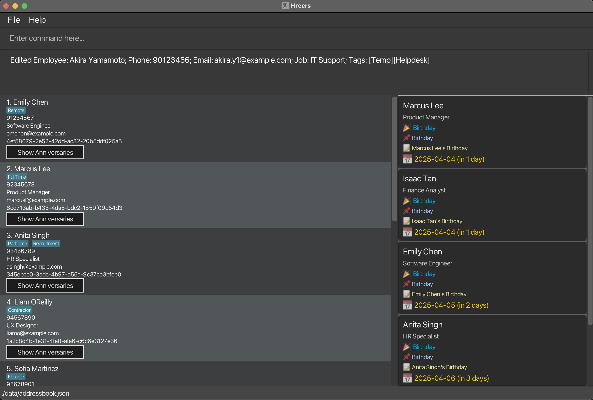

## **Product name: H'Reers**

### ***Target users:***
HR workers in small companies who are responsible for managing employee engagement and morale. These users often have multiple administrative tasks and struggle to keep up with birthdays, anniversaries, and festive greetings. They can type quickly and prefer CLI over GUI.

### ***Value Proposition:***

We can now have assurance that we aren’t missing any customary birthday/festive remarks.

‘H’Reers automates the process of sending custom birthday and anniversary messages for small company HR workers.

**Optimized** for CLI users, it streamlines contact management and **ensures timely, personalized greetings**, enhancing employee engagement with minimal effort.

### Where to find us

* **GitHub**: [https://github.com/AY2425S2-CS2103T-F12-4/tp](https://ay2425s2-cs2103t-f12-4.github.io/tp/)
* **Product Website**: ['H'Reers](https://ay2425s2-cs2103t-f12-4.github.io/tp/)

### Acknowledgments
* This project is based on the AddressBook-Level3 project created by the **[SE-EDU initiative](https://se-education.org)**.
