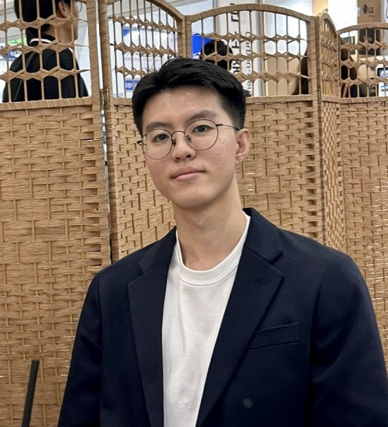
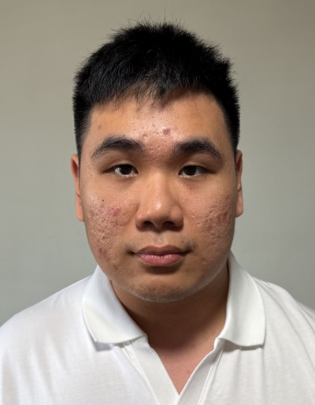
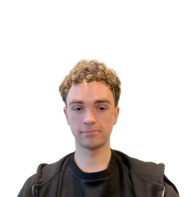
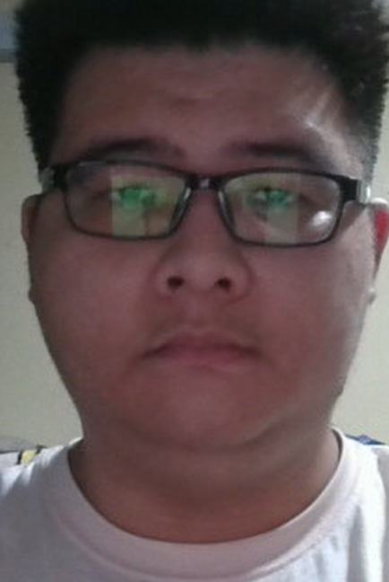

We are a team based in the [School of Computing, National University of Singapore](https://www.comp.nus.edu.sg).

You can reach us at the email `seer[at]comp.nus.edu.sg`

## Project team

### Choi Minseok

[[github](http://github.com/cscms03)]
[[portfolio](team/cscms03.md)]

* Role: Developer
* Responsibilities: UI/UX

### Kim Seung Hyun

[[github](http://github.com/kimseunghyun-kr)]
[[portfolio](team/johndoe.md)]

* Role: Developer
* Responsibilities: Functionalities

### Ang Wei Jian

[[github](https://github.com/WilkinsAng)]
[[portfolio](team/johndoe.md)]

* Role: Developer
* Responsibilities: Making sure testing is done correctly and on time.

### Roman Yanushevskyi

[[github](http://github.com/wailydest)]
[[portfolio](team/johndoe.md)]

* Role: Developer
* Responsibilities: Backend

### Terence Tan

[[github](http://github.com/terentwc)]

* Role: Developer
* Responsibilities: Documentation
