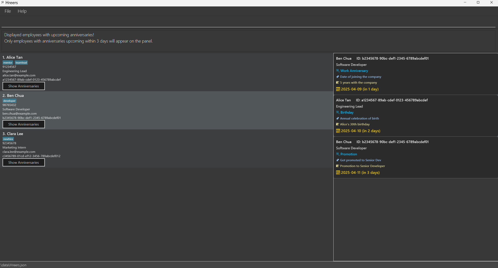
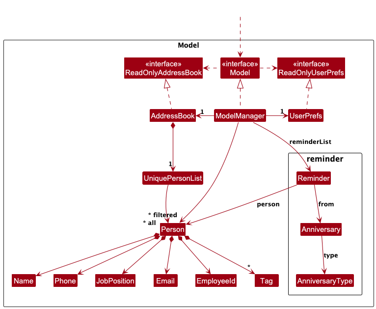
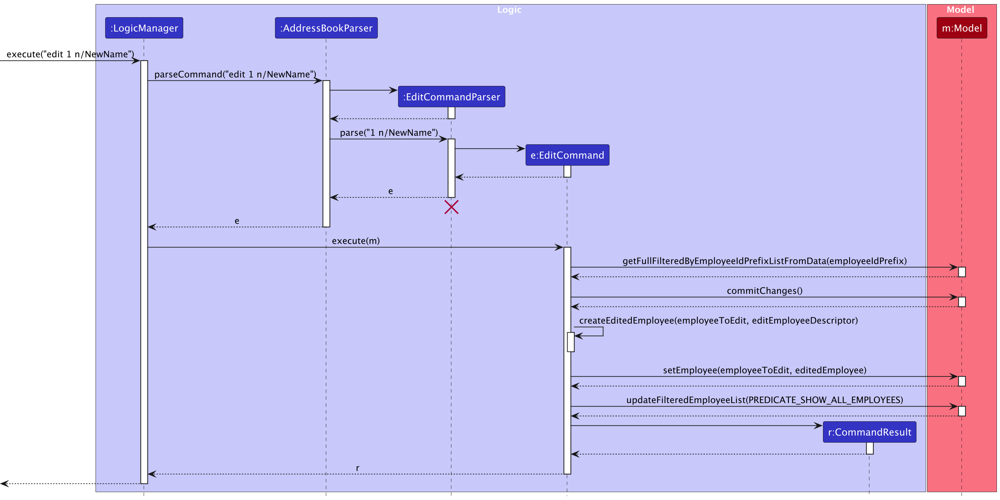
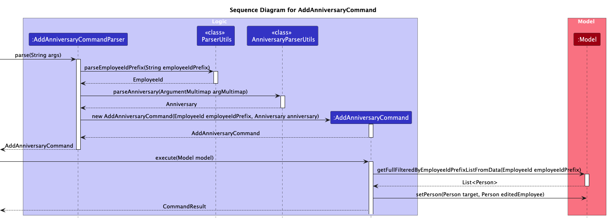
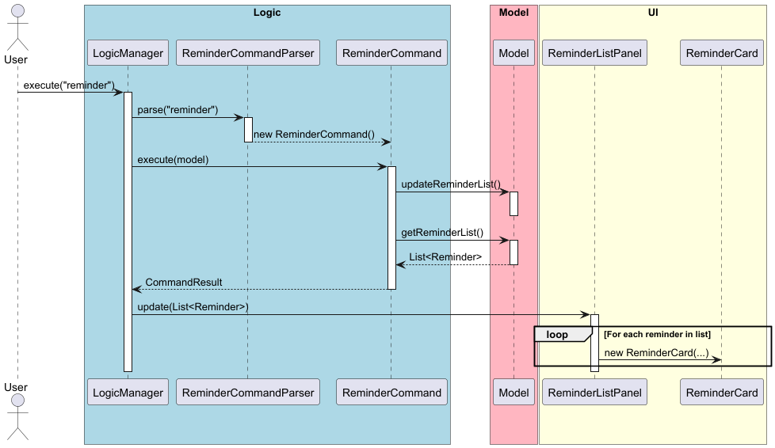
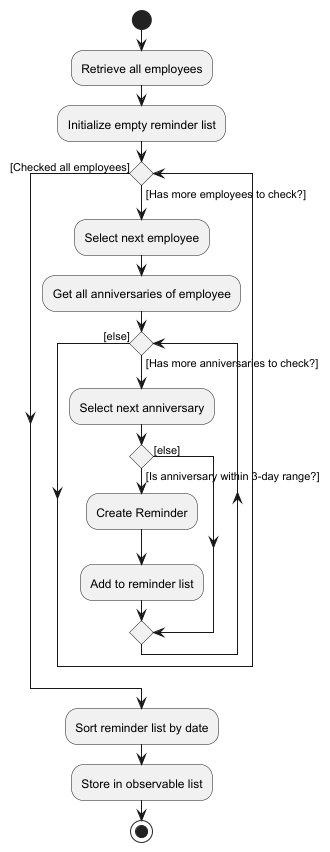
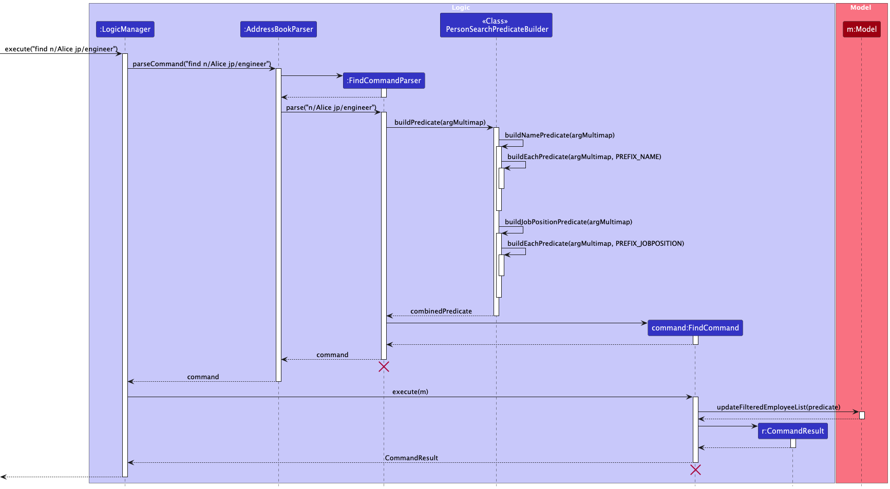
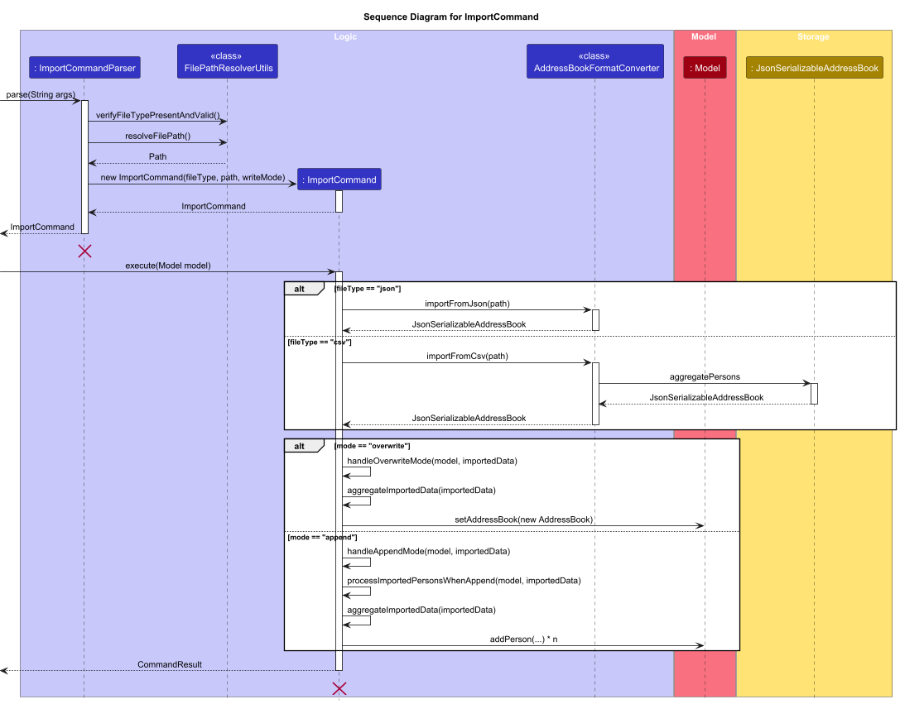
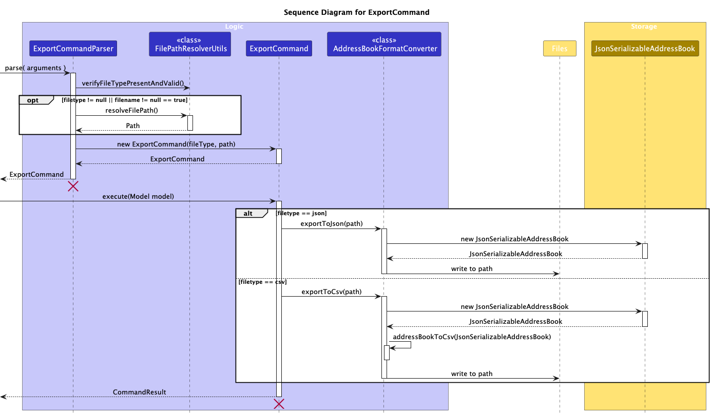

## UI



## *Table of Contents*
1. [UI](#ui)
2. [Setting up, Getting started](#setting-up-getting-started)
3. [Architecture](#architecture)
    1. [UI Component](#ui-component)
    2. [Logic Component](#logic-component)
    3. [Model Component](#model-component)
    4. [Storage Component](#storage-component)
    5. [Common Classes](#common-classes)
4. [Implementation](#implementation)
    1. [Employee Identification](#employee-identification)
    2. [Edit Employee Records](#edit-employee-records)
    3. [Add Anniversary](#addanniversarycommand)
    4. [Delete Anniversary](#deleteanniversarycommand)
    5. [Reminder](#reminder-feature)
    6. [Find Employee Feature](#find-employees-feature)
    7. [Import](#import-feature)
    8. [Export](#export-feature)
5. [Documentation, Logging, Testing, Configuration, Dev-Ops](#documentation-logging-testing-configuration-dev-ops)
6. [Appendix: Requirements](#appendix-requirements)
    1. [Product Scope](#product-scope)
    2. [User Stories](#user-stories)
    3. [Use Cases](#use-cases)
    4. [Non-Functional Requirements](#non-functional-requirements)
    5. [Glossary](#glossary)
7. [Appendix: Instructions for Manual Testing](#appendix-instructions-for-manual-testing)
    1. [Core Features](#core-features)
        1. [Add Employee Records](#add-employee-records)
        2. [Edit Employee Records](#edit-employee-records)
        3. [Delete Employee Records](#delete-employee-records)
        4. [Find Employee Records](#find-employee-records)
        5. [Undo Changes](#undo-changes)
    2. [Anniversary Commands](#anniversary-commands)
        1. [AddAnniversaryCommand](#add-anniversary-command)
        2. [DeleteAnniversaryCommand](#deleteanniversarycommand)
        3. [ShowAnniversaryCommand](#show-anniversary-command)
    3. [File Management](#file-management)
        1. [Export Command](#export-command)
        2. [Save Employee Records](#save-employee-records)
    4. [Viewing Upcoming Anniversaries](#viewing-upcoming-anniversaries-reminder-feature)
8. [Appendix: Planned Enhancements](#appendix-planned-enhancements)

--------------------------------------------------------------------------------------------------------------------

## Acknowledgements

* This project is based on the [AddressBook-Level3 project](https://se-education.org/guides/conventions/java/intermediate.html) created by the [SE-EDU initiative](https://se-education.org). ([UG](https://se-education.org/addressbook-level3/UserGuide.html), [DG](https://se-education.org/addressbook-level3/DeveloperGuide.html), [github](https://github.com/se-edu/addressbook-level3))

--------------------------------------------------------------------------------------------------------------------

## Setting up, getting started

Refer to the guide [_Setting up and getting started_](SettingUp.md).

--------------------------------------------------------------------------------------------------------------------

## Architecture


The ***Architecture Diagram*** given above explains the high-level design of the App.

Given below is a quick overview of main components and how they interact with each other.

**Main components of the architecture**

**`Main`** (consisting of classes [`Main`](https://github.com/AY2425S2-CS2103T-F12-4/tp/blob/master/src/main/java/seedu/address/Main.java) and [`MainApp`](https://github.com/AY2425S2-CS2103T-F12-4/tp/blob/master/src/main/java/seedu/address/MainApp.java)) is in charge of the app launch and shut down.
* At app launch, it initializes the other components in the correct sequence, and connects them up with each other.
* At shut down, it shuts down the other components and invokes cleanup methods where necessary.

The bulk of the app's work is done by the following four components:

* [**`UI`**](#ui-component): The UI of the App.
* [**`Logic`**](#logic-component): The command executor.
* [**`Model`**](#model-component): Holds the data of the App in memory.
* [**`Storage`**](#storage-component): Reads data from, and writes data to, the hard disk.

[**`Commons`**](#common-classes) represents a collection of classes used by multiple other components.

**How the architecture components interact with each other**

The *Sequence Diagram* below shows how the components interact with each other for the scenario where the user issues the command `delete 1`.


Each of the four main components (also shown in the diagram above),

* defines its *API* in an `interface` with the same name as the Component.
* implements its functionality using a concrete `{Component Name}Manager` class (which follows the corresponding API `interface` mentioned in the previous point.

For example, the `Logic` component defines its API in the `Logic.java` interface and implements its functionality using the `LogicManager.java` class which follows the `Logic` interface. Other components interact with a given component through its interface rather than the concrete class (reason: to prevent outside component's being coupled to the implementation of a component), as illustrated in the (partial) class diagram below.


The sections below give more details of each component.

### UI component

The **API** of this component is specified in [`Ui.java`](https://github.com/AY2425S2-CS2103T-F12-4/tp/tree/master/src/main/java/seedu/address/ui)


The UI consists of a `MainWindow` that is made up of parts e.g.`CommandBox`, `ResultDisplay`, `PersonListPanel`, `StatusBarFooter` etc. All these, including the `MainWindow`, inherit from the abstract `UiPart` class which captures the commonalities between classes that represent parts of the visible GUI.

The `UI` component uses the JavaFx UI framework. The layout of these UI parts are defined in matching `.fxml` files that are in the `src/main/resources/view` folder. For example, the layout of the [`MainWindow`](https://github.com/AY2425S2-CS2103T-F12-4/tp/blob/master/src/main/java/seedu/address/MainApp.java) is specified in [`MainWindow.fxml`](https://github.com/AY2425S2-CS2103T-F12-4/tp/blob/master/src/main/resources/view/MainWindow.fxml)

The `UI` component,

* executes user commands using the `Logic` component.
* listens for changes to `Model` data so that the UI can be updated with the modified data.
* keeps a reference to the `Logic` component, because the `UI` relies on the `Logic` to execute commands.
* depends on some classes in the `Model` component, as it displays `Person` object residing in the `Model`.

### Logic component

**API** : [`Logic.java`](https://github.com/AY2425S2-CS2103T-F12-4/tp/tree/master/src/main/java/seedu/address/logic)

Here's a (partial) class diagram of the `Logic` component:


The sequence diagram below illustrates the interactions within the `Logic` component, taking `execute("delete 1")` API call as an example.


<div markdown="span" class="alert alert-info">:information_source: **Note:** The lifeline for `DeleteCommandParser` should end at the destroy marker (X) but due to a limitation of PlantUML, the lifeline continues till the end of diagram.
</div>

How the `Logic` component works:

1. When `Logic` is called upon to execute a command, it is passed to an `AddressBookParser` object which in turn creates a parser that matches the command (e.g., `DeleteCommandParser`) and uses it to parse the command.
1. This results in a `Command` object (more precisely, an object of one of its subclasses e.g., `DeleteCommand`) which is executed by the `LogicManager`.
1. The command can communicate with the `Model` when it is executed (e.g. to delete an employee).<br>
   Note that although this is shown as a single step in the diagram above (for simplicity), in the code it can take several interactions (between the command object and the `Model`) to achieve.
1. The result of the command execution is encapsulated as a `CommandResult` object which is returned back from `Logic`.

Here are the other classes in `Logic` (omitted from the class diagram above) that are used for parsing a user command:


How the parsing works:
* When called upon to parse a user command, the `AddressBookParser` class creates an `XYZCommandParser` (`XYZ` is a placeholder for the specific command name e.g., `AddCommandParser`) which uses the other classes shown above to parse the user command and create a `XYZCommand` object (e.g., `AddCommand`) which the `AddressBookParser` returns back as a `Command` object.
* All `XYZCommandParser` classes (e.g., `AddCommandParser`, `DeleteCommandParser`, ...) inherit from the `Parser` interface so that they can be treated similarly where possible e.g, during testing.

### Model component
**API** : [`Model.java`](https://github.com/AY2425S2-CS2103T-F12-4/tp/tree/master/src/main/java/seedu/address/model)



The `Model` component:

* Stores the address book data i.e. all `Person` objects (which are contained in a `UniquePersonList` object).
* Stores the currently 'selected' `Person` objects (e.g. results of a search query) as a separate `filtered` list which is exposed to outsiders as an unmodifiable `ObservableList<Person>` that can be 'observed'.
  For example, the UI can be bound to this list so that the UI automatically updates when the data in the list changes.
* Stores a `UserPrefs` object that represents the user's preferences. This is exposed to the outside as a `ReadOnlyUserPrefs` object.
* Does not depend on any of the other three components (as the `Model` represents data entities of the domain, they should be able to exist on their own without depending on other components).
* Additionally, the model includes data structures for reminders, such as `Reminder`, `Anniversary`, and `AnniversaryType`. These are used to support the reminder functionality described later in the [Implementation](#implementation) section.

<div markdown="span" class="alert alert-info">:information_source: **Note:** An alternative (arguably, a more OOP) model is given below. It has a `Tag` list in the `AddressBook`, which `Person` references. This allows `AddressBook` to only require one `Tag` object per unique tag, instead of each `Person` needing their own `Tag` objects.<br>


</div>


### Storage component

**API** : [`Storage.java`](https://github.com/AY2425S2-CS2103T-F12-4/tp/tree/master/src/main/java/seedu/address/storage)


The `Storage` component,
* can save both address book data and user preference data in JSON format, and read them back into corresponding objects.
* inherits from both `AddressBookStorage` and `UserPrefStorage`, which means it can be treated as either one (if only the functionality of only one is needed).
* depends on some classes in the `Model` component (because the `Storage` component's job is to save/retrieve objects that belong to the `Model`)

### Common classes

Classes used by multiple components are in the `seedu.address.commons` package.

--------------------------------------------------------------------------------------------------------------------
## Implementation
This section describes some noteworthy details on how certain features are implemented.

---
### Employee Identification

Our employeeId utilize a UUID based prefix matching system.
The employeeId is generated using the `UUID` class in Java, which creates a universally unique identifier. This identifier is then used as a prefix for each employee's record, allowing for easy searching and retrieval of information.

#### Prefix Conflict Restriction

The system strictly enforces that no prefix conflicts can exist between any two employee IDs. A prefix conflict occurs when one employee ID is a prefix of another employee ID (as defined in the glossary). This restriction is necessary for the prefix matching system to work correctly and to ensure unambiguous identification of employees when only a prefix of their ID is provided in commands.

For example, if one employee has the ID `abc123` and another employee has the ID `abc123456`, this would create a prefix conflict because `abc123` is a prefix of `abc123456`, making it impossible to uniquely identify the employee when only the prefix `abc123` is provided.

#### Prefix Matching Logic

The prefix matching logic is primarily managed within the EmployeeId class, which provides methods to check for these conflicts:
- `isPrefixOf(EmployeeId other)`: Checks if the current ID is a prefix of another ID
- `hasPrefixConflict(EmployeeId other)`: Checks if there's a conflict between two IDs in either direction

The prefix matching logic is primarily managed within the EmployeeId class.
The prefix matching logic is mostly used by the Model and AddressBook class, which serves as the facade
that maintains the internal UniquePersonsList.
This feature is also present in the LogicManager class, where before every command is launched, it triggers a scan throughout the database to check if there are any entries
that violate the prefix matching rule, following the lazy validation principle.

---
### Edit Employee Records

#### Implementation:

The edit command is implemented by the `EditCommand` class, which extends the abstract `Command` class. It works through the following process:

1. The `EditCommandParser` parses the command input to create an `EditEmployeeDescriptor` containing the fields to be updated.
2. The command identifies the target employee using the employee ID prefix.
3. The system verifies that exactly one employee matches the provided prefix.
4. A new employee object is created with updated fields from the descriptor, preserving unchanged fields from the original employee.
5. The system validates that the new employee ID (if changed) doesn't conflict with existing IDs.
6. The original employee record is replaced with the edited version in the model.

The edit command also supports the undo/redo feature by preserving the previous state via the model's commit function.



---
### AddAnniversaryCommand

#### Implementation:
The add anniversary command is implemented by the AddAnniversaryCommand class, which extends the abstract Command class. It works through the following process:

1. The AddAnniversaryCommandParser parses the command input to extract the employee ID prefix and the anniversary details.
2. The command identifies the target employee using the employee ID prefix.
3. The system verifies that exactly one employee matches the provided prefix.
4. The command checks for duplicate anniversary entries in the target employee's record.
5. If no duplicate exists, a new employee object is created with an updated anniversary list, while preserving unchanged fields from the original employee.
6. The original employee record is replaced with the updated version in the model.
7. A success message is returned confirming the addition of the anniversary.



---
### DeleteAnniversaryCommand
#### Implementation:
1. Parsing the Input:
- The DeleteAnniversaryCommandParser tokenizes the input using the PREFIX_EMPLOYEEID (eid/) and PREFIX_ANNIVERSARY_INDEX (ai/). It validates that both required prefixes are present. Missing prefixes trigger a ParseException with the usage message.

2. Validating and Converting Input:
- The parser uses ParserUtil.parseEmployeeIdPrefix() to validate and convert the employee ID prefix. It uses ParserUtil.parseIndex() to convert the anniversary index string into an Index object. An additional check confirms that the index is within acceptable bounds (non-negative).

3. Identifying the Target Employee:
- In the execute method of DeleteAnniversaryCommand, the system retrieves all employees whose IDs start with the given prefix.

4. It verifies that exactly one employee matches:
- If multiple employees are found, it throws a CommandException with a corresponding error message. If no employee is found, it also throws a CommandException.

5. Deleting the Anniversary:
- The command retrieves the target employee’s anniversary list. It checks whether the provided index is within the bounds of this list. If valid, the anniversary at the specified index is removed.

6. Updating the Employee Record:
- A new employee object is created using the builder pattern with the updated anniversary list while preserving unchanged fields (e.g., employee ID, name, job position, email, phone, tags). The model is updated by replacing the old employee record with the new one.

7. Returning the Outcome:
- On successful deletion, the command returns a success message that includes the details of the deleted anniversary.


---
### Reminder Feature

The **reminder** feature is facilitated by the `ReminderCommand`. It helps users view upcoming birthdays and work anniversaries by scanning through all stored employees and collecting relevant date-based reminders.

Internally, this feature is supported by:
- The `Reminder` model class – Represents an upcoming event (e.g., birthday, work anniversary) associated with a `Person`.
- `Model#updateReminderList()` – Gathers all relevant upcoming anniversaries and stores them in an observable list.
- `Model#getReminderList()` – Provides read-only access to the current list of reminders.
- `ReminderListPanel` and `ReminderCard` in the UI – Display reminders to the user in the interface.

The `ReminderCommand` executes the following:
1. Calls `Model#updateReminderList()` to find anniversaries within the next 3 days.
2. Each `Reminder` is created with a `Person`, `AnniversaryType`, date, and description.
3. Results are sorted by upcoming date and stored in an observable list.
4. The UI automatically updates by binding to this observable list.

Given below is an example use case showing how the reminder feature behaves step-by-step.

**Step 1.** The user launches the application, which contains several employee entries with birthday and work anniversary dates.

**Step 2.** The user executes the command:
```
reminder
```
This triggers the `ReminderCommand`, which performs the following steps internally:
- Retrieves all employees via `Model#getFilteredPersonList()`.
- For each employee, iterates through all anniversaries.
- Checks whether each anniversary is within **3 days** from today.
- Creates a `Reminder` object for each upcoming event.
- Sorts the list of reminders by date.
- Stores the sorted reminders in an observable list using `Model#updateReminderList()`.

**Step 3.** The `ReminderListPanel` in the UI detects the update in the observable list and renders each reminder using a `ReminderCard`. Each card shows:
- The employee’s name and job position.
- The type of anniversary (e.g., "Birthday", "Work Anniversary").
- A short description and how soon the event is (e.g., “upcoming in 2 days”).

> 💡 **Note:**
> If multiple reminders exist for a single employee (e.g., birthday and work anniversary in the same week), they will each be listed as **separate reminders**.

Internally, this feature is supported by:
- The `Reminder` model class – Represents an upcoming event (e.g., birthday, work anniversary) associated with a `Person`.
- `Model#updateReminderList()` – Gathers all relevant upcoming anniversaries and stores them in an observable list.
- `Model#getReminderList()` – Provides read-only access to the current list of reminders.
- `ReminderListPanel` and `ReminderCard` in the UI – Display reminders to the user in the interface.

The `ReminderCommand` executes the following:
1. Calls `Model#updateReminderList()` to find anniversaries within the next 3 days.
2. Each `Reminder` is created with a `Person`, `AnniversaryType`, date, and description.
3. Results are sorted by upcoming date and stored in an observable list.
4. The UI automatically updates by binding to this observable list.

Given below is an example use case showing how the reminder feature behaves step-by-step.

**Step 1.** The user launches the application, which contains several employee entries with birthday and work anniversary dates.

**Step 2.** The user executes the command:
```
reminder
```
This triggers the `ReminderCommand`, which performs the following steps internally:
- Retrieves all employees via `Model#getFilteredPersonList()`.
- For each employee, iterates through all anniversaries.
- Checks whether each anniversary is within **3 days** from today.
- Creates a `Reminder` object for each upcoming event.
- Sorts the list of reminders by date.
- Stores the sorted reminders in an observable list using `Model#updateReminderList()`.

**Step 3.** The `ReminderListPanel` in the UI detects the update in the observable list and renders each reminder using a `ReminderCard`. Each card shows:
- The employee’s name and job position.
- The type of anniversary (e.g., "Birthday", "Work Anniversary").
- A short description and how soon the event is (e.g., “upcoming in 2 days”).

> 💡 **Note:**
> If multiple reminders exist for a single employee (e.g., birthday and work anniversary in the same week), they will each be listed as **separate reminders**.

> 🛡️ **Note:**
> Only anniversaries falling within the next `3` days will be displayed. This range is controlled by the constant `REMINDED_DATE_RANGE`.

#### Sequence Diagram

The following sequence diagram illustrates the steps described above:



Note: The filtering logic (`within 3 days`) is abstracted into the model for separation of concerns.

#### Activity Diagram

The diagram below illustrates the internal logic of how the model filters the reminder list:



The filtering is based on whether an anniversary falls within the next 3 days. In code, this value is stored as a constant:

```java
public static final int REMINDED_DATE_RANGE = 3;
```
---
### Find Employees Feature
The Find feature allows users to filter and view employees in the address book based on search criteria such as name and job position. This section explains how the feature is implemented and how it behaves under different inputs.

The Find feature is primarily driven by:

* FindCommand: Executes the filtered search based on a predicate

* FindCommandParser: Parses user input and builds the corresponding predicate

* PersonSearchPredicateBuilder: Constructs combined Predicate<Employee> from argument values

* Model: Provides access to the filtered employee list and the update mechanism

Given below is an explanation of how the Find feature works:
When a user enters a command such as:
`find n/Alice jp/engineer` the following steps occur:

Step 1. FindCommandParser uses ArgumentTokenizer to extract the values for prefixes (`n/`, `jp/`).

Step 2. It checks for errors such as:
- No valid prefixes
- Empty input values for all fields
- Invalid preamble

If the tokens are valid, it delegates predicate construction to PersonSearchPredicateBuilder.

Step 3. The builder constructs Predicate<Employee> objects for each field:
- NameContainsKeywordsPredicate
- JobPositionContainsKeywordsPredicate

The two predicates behave slightly differently to suit their field contexts:
- NameContainsKeywordsPredicate uses partial matching.
  This allows users to match names using any substring of a word.
    - `n/Ali` matches with "Alice Tan", "Khalid Ali"
- JobPositionContainsKeywordsPredicate uses full-word matching.
  A keyword must match a whole word in the job position exactly (case-insensitive).
    - `jp/engineer` matches "Software Engineer", "Senior Engineer".
    - `jp/eng` does not match "Software Engineer", "Senior Engineer".

This design was decided because:
- Partial matching in names is user-friendly — users often search by fragments of names.
- Full word matching in job titles avoids false positives and returns more accurate results in professional roles.

It combines both search predicates with logical `AND` so all conditions must be satisfied for an employee to be included in the search results. For example:
`find n/Alice jp/engineer`matches employees with "Alice" in their name AND "engineer" in their job position.

Meanwhile, each predicate performs keyword-based partial matching (OR logic within the field). For example:
`find n/Alice Bob`matches anyone with "Alice" OR "Bob" in their name.

This design was chosen to support both broad and targeted search strategies:
- A user looking for a specific employee is likely to include more fields (e.g., both name and job position).
- A user performing a general search may only filter by a single field, like a partial name.

This flexible approach aims to enable the command to be both intuitive and powerful, depending on the user’s intent.

Step 4: FindCommand executes by calling:
```
model.updateFilteredEmployeeList(predicate);
```
The `FilteredList<Employee>` inside the model is updated, triggering the GUI to reflect the new list.

The diagram below illustrates the sequence of interactions when a user issues the command `find n/Alice jp/engineer`:


---
### Import Feature

The `import` feature allows users to load external data from JSON or CSV files into the H'reers address book.
It supports two write modes: `append` (to merge with existing records) and `overwrite` (to replace them entirely).

This feature enhances user productivity by allowing them to integrate employee data from external sources such as HR software exports or spreadsheets.

#### Implementation

The import functionality is primarily handled by the following classes:

- `ImportCommand`: Executes the import logic by calling the format converter and updating the model accordingly.
- `ImportCommandParser`: Parses the user's import command input and constructs an `ImportCommand` with the appropriate parameters.
- `AddressBookFormatConverter`: Handles reading from external JSON or CSV files and converting the content into the internal `AddressBook` data structure.

Below is a walkthrough of how the feature works at runtime.

#### Step 1: User executes import command

When the user types a command such as:
```
import ft/json fp/data/ fn/contacts wm/append
```
the `LogicManager` delegates the parsing to `ImportCommandParser`, which constructs an `ImportCommand` using the provided arguments.

#### Implementation

The import functionality is primarily handled by the following classes:

- `ImportCommand`: Executes the import logic by calling the format converter and updating the model accordingly.
- `ImportCommandParser`: Parses the user's import command input and constructs an `ImportCommand` with the appropriate parameters.
- `AddressBookFormatConverter`: Handles reading from external JSON or CSV files and converting the content into the internal `AddressBook` data structure.

Below is a walkthrough of how the feature works at runtime.

#### Step 1: User executes import command

When the user types a command such as:
```
import ft/json fp/data/ fn/contacts wm/append
```
the `LogicManager` delegates the parsing to `ImportCommandParser`, which constructs an `ImportCommand` using the provided arguments.

#### Step 2: Input file is read and parsed

`ImportCommand` calls `AddressBookFormatConverter.convert(...)`, which reads the file based on the given `ft` (file type), and converts it into an internal `AddressBook` object.

- If `ft/json`, it is parsed using Jackson JSON utilities.
- If `ft/csv`, it is manually parsed line-by-line and converted into employees.

#### Step 3: Import is merged or replaces current state

Depending on the `wm/` write mode:

- `append`: New data is merged with existing `AddressBook`. Duplicate employees (based on ID) are replaced.
- `overwrite`: The entire current address book is replaced with the newly imported address book.

#### Step 4: Model and storage are updated

- After merging or replacing, the model is updated using `model.setAddressBook()`, and the new data is committed to storage.

#### Sequence Diagram

The following sequence diagram illustrates the steps described above:



---
### Export Feature
#### Implementation:
1. Parsing the Input:
- The ExportCommandParser tokenizes the user input using the prefixes for file type (ft/), file path (fp/), and filename (fn/).
- It calls verifyFileTypePresentAndValid from the FilePathResolverUtils to ensure the file type is provided and valid.
- The parser retrieves the optional file path and filename values.
- The final file path is determined by calling FilePathResolverUtils.resolveFilePath(filePath, filename, fileType).

2. Command Construction:
- After resolving the file type and file path, a new ExportCommand instance is created with these parameters.
- The command object stores the file type as a string and the file path as a Path object.

3. Executing the Export:
- In the execute method of ExportCommand, the command:
- Retrieves the current list of filtered employees from the model.
- Checks whether there are any employees to export; if none, it throws a CommandException.
- Depending on the file type:
- If "json", it calls AddressBookFormatConverter.exportToJson(displayedEmployees, path).
- If "csv", it calls AddressBookFormatConverter.exportToCsv(displayedEmployees, path).
- The export process is logged using the application's logger for tracking purposes.
- Any errors during file writing or conversion result in a caught exception and an appropriate error message.

4. Returning the Outcome:
- Upon successful export, the command returns a CommandResult containing a success message with details of the export (number of employees, file type, and resolved file path).



--------------------------------------------------------------------------------------------------------------------
## Documentation, logging, testing, configuration, dev-ops

* [Documentation guide](Documentation.md)
* [Testing guide](Testing.md)
* [Logging guide](Logging.md)
* [Configuration guide](Configuration.md)
* [DevOps guide](DevOps.md)

--------------------------------------------------------------------------------------------------------------------

## Appendix: Requirements

### Product scope

**Target user profile**:
HR workers in small companies who are responsible for managing employee engagement and morale. These users often have multiple administrative tasks and struggle to keep up with birthdays, anniversaries, and festive greetings. They can type quickly and prefer CLI over GUI.

**Value proposition**:
We can now have assurance that we aren’t missing any customary birthday/festive remarks. ‘H’Reers automates the process of sending custom birthday and anniversary messages for small company HR workers. Optimized for CLI users, it streamlines contact management and ensures timely, personalized greetings, enhancing employee engagement with minimal effort.


### User stories

Priorities: High (must have) - `* * *`, Medium (nice to have) - `* *`, Low (unlikely to have) - `*`

| Priority | As a …​                                     | I want to …​                       | So that I can…​                                                |
| -------- |---------------------------------------------|------------------------------------|----------------------------------------------------------------|
| `* * *`  | new HR worker using this for the first time | add employees' contact details     | easily manage my company's records                             |
| `* * *`  | HR worker                                   | delete an old employee's records   | remove outdated or incorrect information from the system       |
| `* * *`  | HR worker                                   | view reminders for upcoming events | be prepared and not miss any anniversary events.               |
| `* * *`  | HR worker                                   | view employee's details            | know if a certain employee has any anniversarys coming up soon |
| `* *`    | HR worker                                   | go back to the previous page       |                                                                |
| `*`      | HR worker                                   | have buttons                       | rest my fingers from typing                                    |


### Use cases

#### Use case 1: Adding an Employee

**System**: H'Reers

**Use case**: UC01 - Add New Employee

**Actor:** HR Worker


**Preconditions:**
- The system is running.
- The HR worker has valid employee data to input.

**Guarantees:**
- The employee record is stored successfully in the system.
- If an error occurred, the system remains unchanged.

**Main Success Scenario (MSS)**:
1. HR worker chooses to add new employee.
2. HR worker enters required details
3. If valid, the system adds the employee record to the database.
4. The system displays confirmation: `Employee John Doe added successfully.`

**Alternative Flows:**

- If the format is incorrect, an error message is displayed (e.g., `Error: Invalid date format`).
- If the email already exists, the system rejects the entry: `Error: Employee already exists.`

---

**Extensions**

* 2a. The list is empty.

  Use case ends.

* 3a. The given index is invalid.

    * 3a1. H'Reers shows an error message.

      Use case resumes at step 2.

---
#### Use case 2: Showing Anniversaries

**System**: H'Reers

**Use case**: UC02 - Add New Employee

**Actor:** HR Worker

**Preconditions**:
- The employee exists in the system, identified by their Employee ID.

**Guarantees**:
- The anniversaries associated with the specified employee are displayed.

**Main Success Scenario (MSS)**:
1. HR Worker enters the `showAnni` command with the specified employee’s ID.
2. H'Reers retrieves the list of anniversaries associated with the employee.
3. H'Reers opens a new window or panel displaying:
    - Each anniversary’s name, date, and description (if any).
4. A confirmation message is displayed, indicating successful retrieval.
5. Use case ends.

**Extensions**:
- 1a. Employee Not Found:
    - H'Reers displays an error message indicating that no employee matches the specified ID.
    - Use case ends.

- 1b. Preamble Found:
    - H'Reers displays an error message indicating that the correct usage of the command.
    - Use case ends.

- 3a. No anniversaries found:
    - H'Reers displays a new window with no anniversaries found.
    - Use case resumes at step 5.

---

#### Use case 3: Find Employees

**System**: H'Reers

**Use case**: UC03 – Find Employees

**Actor:** HR Worker

**Preconditions**:
- The system has at least one employee record stored.

**Guarantees**:
- Employees matching the specified search criteria are displayed.
- The filtered list replaces the currently displayed list.
- If no employees match the criteria, an empty list is shown.
- The system state remains unchanged.

**Main Success Scenario (MSS)**:
1. HR Worker enters the `find` command with one or more search criteria using supported prefixes (`n/`, `jp/`).
2. H'Reers filters the employee list using a combined predicate and displays the filtered list.
3. A success message is shown indicating how many results were found.
4. Use case ends.

**Extensions**:
- 1a. No Prefix Provided:
    - H'Reers displays an error message indicating to add at least one prefix.
    - Use case ends.

- 1b. Preamble Found:
    - H'Reers displays an error message indicating the command format is invalid.
    - Use case ends.

- 1c. All Fields Empty:
    - H'Reers displays an error message indicating to add at least one prefix.
    - Use case ends.

- 2a. No Matching Employees Found:
    - H'Reers displays an empty list.
    - Use case resume at step 3.
---

### Non-Functional Requirements


1. **Performance**
- Application must start within 3 seconds on standard hardware
- All commands must execute with response time under 1 second
- System must handle up to 1000 employee records without performance degradation
- Reminder calculations must complete within 2 seconds even with maximum load

2. **Reliability**
- Data persistence with automatic saving after any modification
- Backup creation before high-risk operations
- Undo functionality must restore system to previous state with 100% accuracy

3. **Usability**
- The product should be for a single user
- CLI commands must follow consistent syntax patterns
- New HR users should master core functions within 10 minutes
- A user with above average typing speed for regular English text (i.e. not code, not system admin commands) should be able to accomplish most of the tasks faster using commands than using the mouse
- Error messages must clearly explain issues and suggest corrections

4. **Compatibility**
- Should work on any _mainstream OS_ as long as it has Java `17` or above installed.
- Data files must maintain backward compatibility with previous versions
- Export formats (JSON, CSV) must be compatible with standard HR tools like Excel

5. **Maintainability**
- Code documentation for all major components
- Minimum 80% unit test coverage
- Modular architecture allowing feature extensions
- Clear separation of concerns between UI, Logic, Model, and Storage components

### Glossary

* **Mainstream OS**: Windows, Linux, Unix, MacOS
* **Private contact detail**: A contact detail that is not meant to be shared with others
* **Prefix conflict**: When two Employee IDs are such that one ID is a beginning of the other.

--------------------------------------------------------------------------------------------------------------------
## Appendix: Instructions for manual testing

Given below are instructions to test the app manually.

<div markdown="span" class="alert alert-info">:information_source: **Note:** These instructions only provide a starting point for testers to work on;
testers are expected to do more *exploratory* testing.

</div>

### Launch and shutdown

- Initial launch

    1. Download the jar file and copy into an empty folder

    2. Open your command prompt (on Windows) or terminal (on Mac/Linux).
    3. Navigate to the folder where you saved the .jar file. For example:
        ```bash
         cd /path/to/your/folder
        ```
    4. Run this command:
        ```bash
        java -jar hreers.jar
        ```
        * Expected: Shows the GUI with a set of sample contacts. The window size may not be optimal.

- Saving window preferences

    1. Resize the window to an optimum size. Move the window to a different location. Close the window.

    2. Re-launch the app by running `java -jar hreers.jar`.<br>
       Expected: The most recent window size and location is retained.

---
### Core Features

---
### Add Employee Records

#### Prerequisites:
H'Reers is running.

#### Test Case 1: Add an employee with birthday and work anniversary
```
add n/John Doe p/98765432 e/johnd@example.com 
jp/President bd/2001-01-01 wa/2020-07-08
```

#### Expected Result:
* `John Doe` is added to H'Reers.
* His birthday and work anniversary are automatically created.
* Success message is shown confirming the addition.

#### Test Case 2: Invalid date format
```
add n/Linda Lee p/98765432 e/lindalee@example.com 
jp/Nurse bd/12-01-2000
```

#### Expected Result:
* Command fails with error message: `Anniversary date must be in YYYY-MM-DD format.`
* No employee is added.

---
### Delete Employee Records

#### Purpose:
Allows HR workers to remove outdated or incorrect employee records.
#### Command Format:
```
delete n/NAME p/POSITION b/BIRTHDAY wa/WORK_ANNIVERSARY
```
#### Example Commands:
```
delete n/John Doe p/Software Engineer b/1990-05-10 wa/2015-07-20
```
#### Outputs:
- **Success:** `Employee John Doe deleted successfully.`
- **Failure:** `Error: Employee not found.`
#### Duplicate Handling:
If multiple employees match, prompt for additional details to ensure correctness.

---
### Edit Employee Records
#### Purpose:
Allows HR workers to modify existing employee information, such as name, phone number, email, job position, or tags.
#### Command Format:
```
edit EMPLOYEE_ID_PREFIX [n/NAME] [p/PHONE] [e/EMAIL] [j/JOBPOSITION] [t/TAG]... [eid/EMPLOYEE_ID]
```
#### Example Commands:
```
edit abcd12 p/91234567 e/johndoe@example.com eid/efgh3123
```
```
edit 5678ef n/Jane Smith j/Senior Manager t/management
```
#### Parameter Rules:
- **EMPLOYEE_ID_PREFIX**: Must match exactly one employee in the system
- **NAME**: Alphabets and spaces only, case-insensitive
- **PHONE**: Numbers only
- **EMAIL**: Must contain '@' and valid domain
- **JOBPOSITION**: Must be a valid job position
- **TAG**: Alphanumeric words
- **EMPLOYEE_ID**: Valid UUID format
#### Outputs:
- **Success**: `Edited Employee: [name] Phone: [phone] Email: [email] Job Position: [jobPosition] Tags: [tags]`
- **Failure**: Various error messages depending on the issue:
    - `At least one field to edit must be provided.`
    - `Multiple employees found with prefix XYZ`
    - `No employee found with prefix XYZ`
    - `The new employee ID conflicts with existing employee IDs`

---
### Find Employee Records

#### Prerequisites:
H'Reers is running and has employees:
* Alex Yeoh (Hiring General)
* David Li (Coding Manager)

#### Test Case 1: Find by name only (partial match)
```
find n/Alex Li
```

#### Expected Result:
* Employee list is filtered to show:
    * Alex Yeoh
    * Charlotte Oliveiro
    * David Li
* Success message is shown: 3 employees listed!

#### Test Case 2: No prefix provided
```
find Alice
```

#### Expected Result:
* Command fails with:  `Invalid command format!`
* No filtering occurs.

---
### Undo Changes
#### Purpose:
Allows HR workers to revert the most recent change made to the employee records, such as undoing an added or deleted employee.

#### Command Format:
```
undo
```
#### Functionality:
* **Undo Last Action**: Reverts the most recent change made to the employee data. If the last operation was adding a new employee, the employee will be removed. If the last operation was deleting an employee, the employee will be restored.
##### Outputs:
* **Success**: Undo successful. Last action reverted.
* **Failure**: Error: No changes to undo. (This will occur if there are no actions to undo or the history stack is empty.)
---
### Anniversary commands
#### Purpose:
Allows HR workers to manage employee anniversaries.

---
### Anniversary commands
This section details the manual testings that can be done to commands related to managing employee anniversaries, including adding, deleting, and viewing anniversaries.

---
### Add Anniversary Command

Prerequisites: Ensure the application is running with an existing employee in the database. This employee's employeeID prefix will be termed `EID` for this section
#### Test Case 1: Standard Anniversary Creation (Success)
```plaintext
addAnni eid/<EID> d/2024-06-15 an/Company Foundation Day at/Corporate
atdesc/Annual company celebration ad/Celebrating our company's founding
```
#### Expected Result: Standard Anniversary Created for the Employee
A new anniversary is added to the employee with ID starting with `EID`.
The anniversary has 
- **name** "Company Foundation Day"
- **date** "2024-06-15"
- **type** "Corporate"
- **type description** "Annual company celebration"
- **description** "Celebrating our company's founding".

Success message: "New anniversary added: [anniversary details]" is displayed.

#### Test Case 2: Missing EmployeeId (Failure)
```plaintext
addAnni d/2024-06-15 an/Company Foundation Day at/Corporate
```
#### Expected Result: Standard Anniversary Creation Failed
No anniversary is added.
Error message: "Invalid command format! [usage information]" is displayed.

#### Test Case 3: Malformed Date (Failure)
```plaintext
addAnni eid/EID d/15-06-2024 an/Company Foundation Day at/Corporate
```
#### Expected Result: Standard Anniversary Creation Failed
No anniversary is added.
Error message: "Anniversary date must be in YYYY-MM-DD format." is displayed.

---
### DeleteAnniversaryCommand

Prerequisites: Ensure the application is running with an existing employee in the database, with at least one anniversary associated, except for test case 2. This employee's employeeID prefix will be termed `EID` for this section.

#### Test Case 1:Standard Anniversary Deletion (Success)
```plaintext
deleteAnni eid/EID ai/1
```
#### Expected Result: Standard Anniversary Deletion Successfully executed
Anniversary with index 1 is removed from the given employee
Success message: "Anniversary deleted: [anniversary details]" is displayed.

#### Test Case 2: Employee has No anniversary (Failure)
Prerequisite : Ensure the application is running with an existing employee with no anniversary.
```plaintext
deleteAnni eid/EID ai/1
```
#### Expected Result: Standard Anniversary Deletion Failed
No anniversary is deleted.
Error message: "The index you are searching for is out of bounds for the anniversary." is displayed.

#### Test Case 3: Missing EmployeeId (Failure)
``` plaintext
Test case: deleteAnni eid/ ai/1
```
#### Expected Result: Standard Anniversary Deletion Failed
No anniversary is deleted.
Error message: "Invalid command format!
deleteAnni: deletes an anniversary to the employee identified by a prefix of their Employee ID.
Parameters: eid/EMPLOYEE_ID ai/index " is displayed.

---
### Show Anniversary Command

#### Prerequisites:
H'Reers is running and has employee:
* Alex Yeoh (eid: 4b190...)

#### Test Case 1: Show anniversaries for an employee with no anniversaries
Edit the eid accordingly.
```
showAnni eid/4b190
```

#### Expected Result:
* A new window opens.
* The anniversary list is empty.
* Success message is still shown: Anniversaries shown for employeeId [full Eid]

#### Test Case 2: Invalid command format (missing prefix)
```
showAnni 4b190
```

#### Expected Result:
* Command fails with: Invalid command format!
* No window opens.

```
showAnni eid/EMPLOYEE_ID
```

#### Example Commands:
```
showAnni eid/efgh3123
```
---
### File Management

---
### Export Command
Prerequisites: Ensure the application is displaying some data of choice, except for test case 5
#### Test Case 1:Standard JSON Export (Success)
``` plaintext
export ft/json
```
#### Expected Result:
a json file containing data that is currently being displayed beside the jar file in an `/output/` directory.
Success message: "Exported <number> employees to json format to jar file location" is displayed.

#### Test Case 2:Standard CSV Export (Success)
``` plaintext
export ft/csv
```
#### Expected Result:
a csv file containing data that is currently being displayed beside the jar file in an `/output/` directory.
note that the csv file will contain multiple rows of the same employee should the employee had multiple anniversaries
Success message: "Exported <number> employees to csv format to jar file location" is displayed.


#### Test Case 3:Standard JSON Export With Name (Success)
``` plaintext
export ft/json fn/contacts
```
#### Expected Result:
a json file containing data that is currently being displayed beside the jar file as contacts.json
Success message: "Exported <number> employees in json format to contact.json.

#### Test Case 4:Standard JSON Export With Name and File Path (Success)
``` plaintext
export ft/json fn/contacts fp/./output/kraken
```
#### Expected Result:
a json file containing data that is currently being displayed beside the jar file as <filepath>/contacts.json
Success message: "Exported <number> employees in json format to ./outputs/kraken/contacts.json

#### Test Case 5:Export With Nothing Shown (Failure)
``` plaintext
find n/<some name that does not exist in the database>
export ft/json
```
#### Expected Result:
Error message: "No people to export." is displayed.

---
### Import Command
Prerequisites: 
1. Ensure a valid json file exists for test case 1-2, this can be created via export
2. a valid csv file exists for test cases 3-4, this can be created via export command
3. tests requiring empty files can be created by creating a new file with correct file extension and no content
4. formats that do not conform to the exported files may cause errors.
5. csv files that have been opened by microsoft excel can cause error, due to excel's `smart formatting` features, which may cause the file to be saved in a different format, and the formats of columns to be changed
6. ensure that csv files that have been created conform to all the required rules set in the User Guide, such as requiring the file to be saved in utf-8 format.
7. Any non-compliance of the rules mentioned above and the rules in the user guide may cause the import to fail, and we do not guarantee their successes. Extreme cases may even cause silent failures.
8. Especially for Arabic language settings or Japanese word settings where the input goes from right to left, we do not support such encodings.
9. Ensure that for valid cases, the file path is correct, and the file exists in the specified location.
10. We will assume that the export section has been done prior, and will use the files created accordingly.
11. note that duplicated fields will be allowed for json. For single fields, the bottommost field will be used, and the rest will be ignored. This is due to not using `JSONPARSER_STRICT`, to allow some flexibility in the file format.
12. no embedded newlines into fields are allowed.

#### Test Case 1:Standard JSON Import Overwrite (Success)
``` plaintext
import ft/json fp/./output/ fn/output wm/overwrite
```
#### Expected Result ( no issues ):
your current app will be overwritten by file content
Success message: "Successfully imported <number> contacts, overwriting existing data." is displayed.

#### Expected Result ( has issues ):
your current app will not be overwritten by file content
- omitted field : "Invalid data in import file: Employee's <field> field is missing!" is displayed
- prefix collision ( an employee prefix in the file collides with another employee prefix in the file ) : "Found multiple employees with employeeId starting with <id2>=<id1>" is displayed
- identity collision ( same employeeId, different details ) : "conflicting records found <person1> \n <person2>" is displayed
- invalid file : "Failed to read the file: the json file is invalid or corrupted." is displayed
- empty file : "The JSON file is empty. Please provide a valid file." is displayed

#### Test Case 2:Standard Json Import Append (Success)
``` plaintext
import ft/json fp/./output/ fn/output wm/append
```
#### Expected Result:
your current visual appended by file content.
this test case subsumes all of the file related errors that is presented above
note that the `append` mode will result in the following regressive effects
1. if the app currently contains employees with the same EmployeeId , name, email, phone, tags, job position, the anniversaries within the json file will be merged into the existing employees
2. if the app currently contains employees with the same EmployeeId, but differ in any of the other fields, the employees will be put into omitted list for manual conflict resolution, that will be displayed.
3. if the app currently contains employees that have a EmployeeId that is a Prefix of an employee currently present in the app, the employees will be put into omitted list for manual conflict resolution, that will be displayed.
4. If the file contains employees that are not present in the app, they will be added to the app.

#### Expected Result ( no conflicts ):
Success message: "Successfully imported <number> contacts, skipped 0.
Please resolve conflicts manually
+ Conflicting records found: " is displayed.

#### Expected Result ( has conflicts - <assume only a single conflict>):
Success message: "Successfully imported <number - 1> contacts, skipped 1.
Please resolve conflicts manually
+ Conflicting records found:
  <employee details>"
+ is displayed.

#### Test Case 3:Standard CSV Import Overwrite With Name (Success)
``` plaintext
import ft/csv fp/./output/ fn/output wm/overwrite
```
#### Expected Result:
note that the `csv` mode will result in the following regressive effects
1. all lines with the same employeeId and name, email, phone, tags, job position will be merged into a single Employee.

#### Expected Result ( no issues ):
your current visual overwritten by file content
Success message: "Successfully imported <number> contacts, overwriting existing data." is displayed.

#### Expected Result ( has issues ):
- omitted field : "Invalid data in import file: Employee's <field> field is missing!" is displayed
- prefix collision ( an employee prefix in the file collides with another employee prefix in the file ) : "Found multiple employees with employeeId starting with <id2>=<id1>" is displayed
- identity collision ( same employeeId, different details ) : "conflicting records found <person1> \n <person2>" is displayed
- missing column : "CSV missing required field: <field>" is displayed
- extraenous column : <ROMAN>
- empty file : "CSV data cannot be empty." is displayed

#### Test Case 4:Standard CSV Import Append With Name (Success)
``` plaintext
import ft/csv fp/./output/ fn/output wm/append
```

#### Expected Result:
this test case subsumes all of the file related errors that is presented above
note that the `append` mode will result in the following regressive effects
1. if the app currently contains employees with the same EmployeeId , name, email, phone, tags, job position, the anniversaries within the json file will be merged into the existing employees
2. if the app currently contains employees with the same EmployeeId, but differ in any of the other fields, the employees will be put into omitted list for manual conflict resolution, that will be displayed.
3. if the app currently contains employees that have a EmployeeId that is a Prefix of an employee currently present in the app, the employees will be put into omitted list for manual conflict resolution, that will be displayed.
4. If the file contains employees that are not present in the app, they will be added to the app.

#### Expected Result ( no conflicts ):
Success message: "Successfully imported <number> contacts, skipped 0.
Please resolve conflicts manually
+ Conflicting records found: " is displayed.

#### Expected Result ( has conflicts - <assume only a single conflict>):
Success message: "Successfully imported <number - 1> contacts, skipped 1.
Please resolve conflicts manually
+ Conflicting records found:
  <employee details>"
+ is displayed.

---
### Save Employee Records
#### Purpose:
Ensures employee records persist across sessions.

#### Command Format:
- **Automatically saves every 30 seconds.**

#### Outputs:
- **Success:** `Save occurred successfully.`
- **Failure:** `Save failed -> reverting to backup file.`

#### Additional Targets:
- Full flush backup (complete overwrite).
- Intermediate .tmp file for autosave.

---
### Viewing Upcoming Anniversaries (Reminder Feature)

#### 1. Listing upcoming reminders

1. Prerequisites: The application should contain employees with anniversaries (e.g., birthday, work anniversary) within 3 days from today.

2. Test case: `reminder`
   **Expected**: A list of reminders is shown in the side panel. Each entry includes the employee’s name, job position, the type of anniversary, and how soon it will occur (e.g., “in 2 days”).

3. Test case: `reminder` (when there are no upcoming anniversaries)
   **Expected**: The side panel is updated to show an empty list.

#### 2. Reminder display formatting

1. Reminder card fields to verify:
    - **Employee Name**: Matches the name in the person list.
    - **Job Position**: Matches the employee’s job title.
    - **Anniversary Type + Description**: Shown as `Birthday - John’s birthday` or `Work Anniversary - Joined in 2019`, depending on type and description.
    - **Date Display**: Shows relative time (e.g., “in 1 day”, “in 3 days”).

2. Manual verification:
    - Verify that reminders are **sorted by date** (soonest anniversary appears first).
    - Verify that if an employee has multiple upcoming anniversaries, they appear as **separate entries**.
    - Confirm that expired or future anniversaries **outside the 3-day window** are **not shown**.

3. Edge case testing

- **Test case**: Add a birthday dated exactly 3 days from now → Run `reminder`
  **Expected**: Reminder card for this birthday appears in the list.

- **Test case**: Add a birthday 4 days from now → Run `reminder`
  **Expected**: No reminder card shown.

- **Test case**: Add both a birthday and a work anniversary for the same employee within 3 days
  **Expected**: Two separate reminder cards are shown, one for each anniversary.

- **Test case**: Add reminders for multiple employees
  **Expected**: All applicable reminders appear and are correctly sorted by date.

4. Returning the Outcome:
- Upon successful export, the command returns a CommandResult containing a success message with details of the export (number of employees saved, file type, and resolved file path).

---

## Appendix: Planned Enhancements

Team Size: 5

In future versions of H'Reers, the following enhancements are planned to improve functionality, user experience, and data consistency:

1. **Address the fullscreen bug issue for all new windows**
   - **Current Issue**: Closing windows in fullscreen may cause it to crash.
   - **Method to recreate**
       1. When running the app
       2. Open the app in fullscreen
       3. Type help
       4. Close help window
       5. Repeat 3 and 4 enough times and the app will crash
2. **Address the fullscreen bug issue for all new windows**
   - **Current Issue**: Closing anniversary window when the screen is tiled with the anniversary window and the main window, will cause it to crash
   - **Method to recreate**
       1. Open app
       2. Type showAnni xxx
       3. Fullscreen app and tile them side to side
       4. Close anni window
       5. App stops running and hangs
   - **Current Workaround**: Do not use fullscreen mode.
   - **Planned Solution**: Investigate the cause of the crash and implement a fix to ensure that closing windows in fullscreen mode does not lead to application crashes. It is probably a bug in the JavaFX library.

3. **Stop enforcing the absence of prefix conflicts**
    - **Current Issue**: Enforcing prefix conflicts policy may lead to the situation when no employee addition is possible, as every id would conflict with the existing ones. That would occur when the ids of the employees are very short and fill up all the possible beginnings of the ids.
    - **Current Workaround**: The possibility of such a situation is very low, as the ids are generated randomly and are long enough. The only situation when this may occur is when user deliberately made the ids short. This restriction is documented in the user guide.
    - **Planned Solution**: We plan to stop requiring the absence of prefix conflicts. Instead, to disambiguate the employee id reference, we require the user to put \$ after the full employee id as a terminator, so that the system will know that the user is referring to the full employee id and not just a prefix.

4. **Import Data from Different Formats** 
   - **Current Issue**: Limited feature functionality to various different csv formats available, and lacks robustness in parsing and validation.
   - **Current Workaround**: mention in the user guide to prevent users from using unsupported formats, to follow the export feature's csv format.
   - **Planned solution**: Use external libraries to support more formats and provide better parsing and validation. This will allow users to import data from various sources without worrying about format compatibility.
   
5. **Observer Support for ShowAnni**
   - **Current Issue**: ShowAnni currently does not update dynamically should there be operations on it while the GUI is open.
   - **Current Workaround**: After each operation on Anniversaries, showAnni should be closed and called again.
   - **Planned solution**: We plan to observe GUI means for the UI to automatically update, either by exploring JavaFX GUI observer related options
   
6. **ShowAnni Window is not brought back to screen after it has been minimized**
   - **Current Issue**: ShowAnni currently does not reappear when the showAnni command is called after the popup has been minimized. This might be hard for users to see and understand that their call is working and actually showing the anniversaries.
   - **Current Workaround**: Place this under known issues.
   - **Planned solution**: investigate if JavaFx provides methods to specifically avoid this issue (Same as AB3).

7. **Enhanced Phone Number Validation**
   - **Current Issue**: Phone Numbers cannot have spaces in their format. They also have a limit of 17 digits, which is just to make it not too long
   - **Planned Solution**: Validate phone numbers according to local and international standards, requiring a minimum of 7 digits and ensuring numbers are valid for practical use cases as well as allow spaces between digits.

8. **Inconsistency between showAnni and edit/delete syntax**
   - **Current Issue**: For now, edit and delete command has the following syntax: `[edit/delete] [employeeId] [other arguments]`
   - While the syntax of showAnni is: `[showAnni] eid/[employeeId]`
   - which constitutes an inconsistency with the requirement of prefix before employeeId, although it's mandatory to have employeeId with the showAnni command, just as it is with the edit/delete commands.
   - **Planned Solution**: Make the explicit specification of eid/ prefix unnecessary within showAnni, as the command cannot be used without employeeId anyway.

8. **Greater Support for Anniversary recurrence**
    - **Current Issue**: For now, only a yearly recurrence is supported.
    - **Planned Solution**: Allow greater options for recurrence, such as monthly, weekly, or custom intervals. This will allow users to set reminders for anniversaries that occur more frequently than once a year.
  
