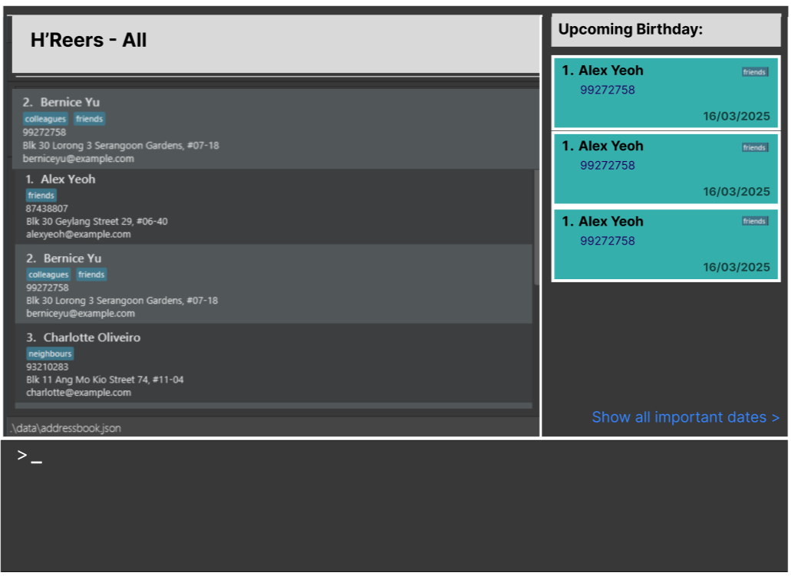

## *Mock UI*



## *Table of Contents*
1. [Mock UI](#mock-ui)
2. [Architecture](#architecture)
    1. [UI Component](#ui-component)
    2. [Logic Component](#logic-component)
    3. [Model Component](#model-component)
    4. [Storage Component](#storage-component)
    5. [Common Classes](#common-classes)
3. [Implementation](#implementation)
    1. [Save Employee Records](#save-employee-records)
    2. smth
4. [Documentation, Logging, Testing, Configuration, Dev-Ops](#documentation-logging-testing-configuration-dev-ops)
5. [Appendix: Requirements](#appendix-requirements)
    1. [Product Scope](#product-scope)
    2. [User Stories](#user-stories)
    3. [Use Cases](#use-cases)
    4. [Non-Functional Requirements](#non-functional-requirements)
    5. [Glossary](#glossary)
6. [Appendix: Instructions for Manual Testing](#appendix-instructions-for-manual-testing)
    1. [Core Features]()
        1. [Add Employee Records](#add-employee-records)
        2. [Edit Employee Records](#edit-employee-records)
        3. [Delete Employee Records](#delete-employee-records)
        4. [Undo Changes](#undo-changes)
    2. [Anniversary Commands](#anniversary-commands)
        1. [AddAnniversaryCommand](#addanniversarycommand)
        2. [DeleteAnniversaryCommand](#deleteanniversarycommand)
        3. [ShowAnniversaryCommand](#showanniversarycommand)
    3. [Reminder for Events](#reminder-for-events)

--------------------------------------------------------------------------------------------------------------------

## **Acknowledgements**

* This project is based on the [AddressBook-Level3 project](https://se-education.org/guides/conventions/java/intermediate.html) created by the [SE-EDU initiative](https://se-education.org). ([UG](https://se-education.org/addressbook-level3/UserGuide.html), [DG](https://se-education.org/addressbook-level3/DeveloperGuide.html),[github](https://github.com/se-edu/addressbook-level3))

--------------------------------------------------------------------------------------------------------------------

## **Setting up, getting started**

Refer to the guide [_Setting up and getting started_](SettingUp.md).

--------------------------------------------------------------------------------------------------------------------

## Architecture


The ***Architecture Diagram*** given above explains the high-level design of the App.

Given below is a quick overview of main components and how they interact with each other.

**Main components of the architecture**

**`Main`** (consisting of classes [`Main`](https://github.com/se-edu/addressbook-level3/tree/master/src/main/java/seedu/address/Main.java) and [`MainApp`](https://github.com/se-edu/addressbook-level3/tree/master/src/main/java/seedu/address/MainApp.java)) is in charge of the app launch and shut down.
* At app launch, it initializes the other components in the correct sequence, and connects them up with each other.
* At shut down, it shuts down the other components and invokes cleanup methods where necessary.

The bulk of the app's work is done by the following four components:

* [**`UI`**](#ui-component): The UI of the App.
* [**`Logic`**](#logic-component): The command executor.
* [**`Model`**](#model-component): Holds the data of the App in memory.
* [**`Storage`**](#storage-component): Reads data from, and writes data to, the hard disk.

[**`Commons`**](#common-classes) represents a collection of classes used by multiple other components.

**How the architecture components interact with each other**

The *Sequence Diagram* below shows how the components interact with each other for the scenario where the user issues the command `delete 1`.


Each of the four main components (also shown in the diagram above),

* defines its *API* in an `interface` with the same name as the Component.
* implements its functionality using a concrete `{Component Name}Manager` class (which follows the corresponding API `interface` mentioned in the previous point.

For example, the `Logic` component defines its API in the `Logic.java` interface and implements its functionality using the `LogicManager.java` class which follows the `Logic` interface. Other components interact with a given component through its interface rather than the concrete class (reason: to prevent outside component's being coupled to the implementation of a component), as illustrated in the (partial) class diagram below.


The sections below give more details of each component.

### UI component

The **API** of this component is specified in [`Ui.java`](https://github.com/se-edu/addressbook-level3/tree/master/src/main/java/seedu/address/ui/Ui.java)


The UI consists of a `MainWindow` that is made up of parts e.g.`CommandBox`, `ResultDisplay`, `PersonListPanel`, `StatusBarFooter` etc. All these, including the `MainWindow`, inherit from the abstract `UiPart` class which captures the commonalities between classes that represent parts of the visible GUI.

The `UI` component uses the JavaFx UI framework. The layout of these UI parts are defined in matching `.fxml` files that are in the `src/main/resources/view` folder. For example, the layout of the [`MainWindow`](https://github.com/se-edu/addressbook-level3/tree/master/src/main/java/seedu/address/ui/MainWindow.java) is specified in [`MainWindow.fxml`](https://github.com/se-edu/addressbook-level3/tree/master/src/main/resources/view/MainWindow.fxml)

The `UI` component,

* executes user commands using the `Logic` component.
* listens for changes to `Model` data so that the UI can be updated with the modified data.
* keeps a reference to the `Logic` component, because the `UI` relies on the `Logic` to execute commands.
* depends on some classes in the `Model` component, as it displays `Person` object residing in the `Model`.

### Logic component

**API** : [`Logic.java`](https://github.com/se-edu/addressbook-level3/tree/master/src/main/java/seedu/address/logic/Logic.java)

Here's a (partial) class diagram of the `Logic` component:


The sequence diagram below illustrates the interactions within the `Logic` component, taking `execute("delete 1")` API call as an example.


<div markdown="span" class="alert alert-info">:information_source: **Note:** The lifeline for `DeleteCommandParser` should end at the destroy marker (X) but due to a limitation of PlantUML, the lifeline continues till the end of diagram.
</div>

How the `Logic` component works:

1. When `Logic` is called upon to execute a command, it is passed to an `AddressBookParser` object which in turn creates a parser that matches the command (e.g., `DeleteCommandParser`) and uses it to parse the command.
1. This results in a `Command` object (more precisely, an object of one of its subclasses e.g., `DeleteCommand`) which is executed by the `LogicManager`.
1. The command can communicate with the `Model` when it is executed (e.g. to delete an employee).<br>
   Note that although this is shown as a single step in the diagram above (for simplicity), in the code it can take several interactions (between the command object and the `Model`) to achieve.
1. The result of the command execution is encapsulated as a `CommandResult` object which is returned back from `Logic`.

Here are the other classes in `Logic` (omitted from the class diagram above) that are used for parsing a user command:


How the parsing works:
* When called upon to parse a user command, the `AddressBookParser` class creates an `XYZCommandParser` (`XYZ` is a placeholder for the specific command name e.g., `AddCommandParser`) which uses the other classes shown above to parse the user command and create a `XYZCommand` object (e.g., `AddCommand`) which the `AddressBookParser` returns back as a `Command` object.
* All `XYZCommandParser` classes (e.g., `AddCommandParser`, `DeleteCommandParser`, ...) inherit from the `Parser` interface so that they can be treated similarly where possible e.g, during testing.

### Model component
**API** : [`Model.java`](https://github.com/se-edu/addressbook-level3/tree/master/src/main/java/seedu/address/model/Model.java)


The `Model` component,

* stores the address book data i.e., all `Person` objects (which are contained in a `UniquePersonList` object).
* stores the currently 'selected' `Person` objects (e.g., results of a search query) as a separate _filtered_ list which is exposed to outsiders as an unmodifiable `ObservableList<Person>` that can be 'observed' e.g. the UI can be bound to this list so that the UI automatically updates when the data in the list change.
* stores a `UserPref` object that represents the user’s preferences. This is exposed to the outside as a `ReadOnlyUserPref` objects.
* does not depend on any of the other three components (as the `Model` represents data entities of the domain, they should make sense on their own without depending on other components)

<div markdown="span" class="alert alert-info">:information_source: **Note:** An alternative (arguably, a more OOP) model is given below. It has a `Tag` list in the `AddressBook`, which `Person` references. This allows `AddressBook` to only require one `Tag` object per unique tag, instead of each `Person` needing their own `Tag` objects.<br>


</div>


### Storage component

**API** : [`Storage.java`](https://github.com/se-edu/addressbook-level3/tree/master/src/main/java/seedu/address/storage/Storage.java)


The `Storage` component,
* can save both address book data and user preference data in JSON format, and read them back into corresponding objects.
* inherits from both `AddressBookStorage` and `UserPrefStorage`, which means it can be treated as either one (if only the functionality of only one is needed).
* depends on some classes in the `Model` component (because the `Storage` component's job is to save/retrieve objects that belong to the `Model`)

### Common classes

Classes used by multiple components are in the `seedu.address.commons` package.

--------------------------------------------------------------------------------------------------------------------
## Implementation:
This section describes some noteworthy details on how certain features are implemented.

### Employee Identification

our employeeId utilize a UUID based prefix matching system.
The employeeId is generated using the `UUID` class in Java, which creates a universally unique identifier. This identifier is then used as a prefix for each employee's record, allowing for easy searching and retrieval of information.
The prefix matching logic is primarily managed within the EmployeeId class.
The prefix matching logic is mostly used by the Model and AddressBook class, which serves as the facade
that maintains the internal UniquePersonsList.
This feature is also present in the LogicManager class, where before every command is launched, it triggers a scan throughout the database to check if there are any entries
that violate the prefix matching rule, following the lazy validation principle.


--------------------------------------------------------------------------------------------------------------------

## **Documentation, logging, testing, configuration, dev-ops**

* [Documentation guide](Documentation.md)
* [Testing guide](Testing.md)
* [Logging guide](Logging.md)
* [Configuration guide](Configuration.md)
* [DevOps guide](DevOps.md)


--------------------------------------------------------------------------------------------------------------------

## **Appendix: Requirements**

### Product scope

**Target user profile**:
HR workers in small companies who are responsible for managing employee engagement and morale. These users often have multiple administrative tasks and struggle to keep up with birthdays, anniversaries, and festive greetings. They can type quickly and prefer CLI over GUI.

**Value proposition**:
We can now have assurance that we aren’t missing any customary birthday/festive remarks. ‘H’Reers automates the process of sending custom birthday and anniversary messages for small company HR workers. Optimized for CLI users, it streamlines contact management and ensures timely, personalized greetings, enhancing employee engagement with minimal effort.


### User stories

Priorities: High (must have) - `* * *`, Medium (nice to have) - `* *`, Low (unlikely to have) - `*`

| Priority | As a …​                                     | I want to …​                       | So that I can…​                                                |
| -------- |---------------------------------------------|------------------------------------|----------------------------------------------------------------|
| `* * *`  | new HR worker using this for the first time | add employees' contact details     | easily manage my company's records                             |
| `* * *`  | HR worker                                   | delete an old employee's records   | remove outdated or incorrect information from the system       |
| `* * *`  | HR worker                                   | view reminders for upcoming events | be prepared and not miss any anniversary events.               |
| `* * *`  | HR worker                                   | view employee's details            | know if a certain employee has any anniversarys coming up soon |
| `* *`    | HR worker                                   | go back to the previous page       |                                                                |
| `*`      | HR worker                                   | have buttons                       | rest my fingers from typing                                    |

*{More to be added}*

### Use cases

**Use case: Adding an Employee**

**Actor:** HR Worker

**Preconditions:**
- The system is running.
- The HR worker has valid employee data to input.

**MSS**
1. HR worker chooses to add new employee.
2. HR worker enters required details
3. If valid, the system adds the employee record to the database.
4. The system displays confirmation: `Employee John Doe added successfully.`

**Alternative Flows:**
- If the format is incorrect, an error message is displayed (e.g., `Error: Invalid date format`).
- If the email already exists, the system rejects the entry: `Error: Employee already exists.`

**Postconditions:**
- The employee record is stored successfully in the system.
- If an error occurred, the system remains unchanged.

---

**Extensions**

* 2a. The list is empty.

  Use case ends.

* 3a. The given index is invalid.

    * 3a1. AddressBook shows an error message.

      Use case resumes at step 2.

*{More to be added}*

### Non-Functional Requirements

1.  Should work on any _mainstream OS_ as long as it has Java `17` or above installed.
2.  Should be able to hold up to 1000 employees without a noticeable sluggishness in performance for typical usage.
3.  A user with above average typing speed for regular English text (i.e. not code, not system admin commands) should be able to accomplish most of the tasks faster using commands than using the mouse.
4.  The product should be for a single user.
5.  No usage of a shared file storage mechanism.

*{More to be added}*

### Glossary

* **Mainstream OS**: Windows, Linux, Unix, MacOS
* **Private contact detail**: A contact detail that is not meant to be shared with others


--------------------------------------------------------------------------------------------------------------------
## **Appendix: Instructions for manual testing**

Given below are instructions to test the app manually.

<div markdown="span" class="alert alert-info">:information_source: **Note:** These instructions only provide a starting point for testers to work on;
testers are expected to do more *exploratory* testing.

</div>

### Launch and shutdown

- Initial launch

    1. Download the jar file and copy into an empty folder

    2. Double-click the jar file Expected: Shows the GUI with a set of sample contacts. The window size may not be optimum.

- Saving window preferences

    1. Resize the window to an optimum size. Move the window to a different location. Close the window.

    2. Re-launch the app by double-clicking the jar file.<br>
       Expected: The most recent window size and location is retained.

---
### **Add Employee Records**

#### Purpose:
Enables HR workers to store employee information, including name, position, birthday, and work anniversary.

#### Command Format:
```
add n/NAME p/POSITION b/BIRTHDAY wa/WORK_ANNIVERSARY e/EMAIL t/TAGS
```

#### Example Commands:
```
add n/John Doe p/Software Engineer b/1990-05-10 wa/2015-07-20 e/johndoe@abc.com
```

#### Parameter Rules:
- **Name**: Alphabets and spaces only, case-insensitive.
- **Position**: Must match predefined job titles.
- **Birthday & Work Anniversary**: Format - YYYY-MM-DD.
- **Email**: Must contain '@domainname.com'.

#### Outputs:
- **Success**: `Employee John Doe added successfully.`
- **Failure**: `Error: Invalid date format.`

#### Duplicate Handling:
- If an employee with the same email exists: `Error: Employee already exists.`

#### Additional Targets:
- Partial addition of data.
- Import employee records from CSV.
---

### **Delete Employee Records**
#### Purpose:
Allows HR workers to remove outdated or incorrect employee records.

#### Command Format:
```
delete n/NAME p/POSITION b/BIRTHDAY wa/WORK_ANNIVERSARY
```

#### Example Commands:
```
delete n/John Doe p/Software Engineer b/1990-05-10 wa/2015-07-20
```

#### Outputs:
- **Success:** `Employee John Doe deleted successfully.`
- **Failure:** `Error: Employee not found.`

#### Duplicate Handling:
If multiple employees match, prompt for additional details to ensure correctness.

---

### **Edit Employee Records**

#### Purpose:
Allows HR workers to modify existing employee information, such as name, phone number, email, job position, or tags.

#### Command Format:

```
edit EMPLOYEE_ID_PREFIX [n/NAME] [p/PHONE] [e/EMAIL] [j/JOBPOSITION] [t/TAG]... [eid/EMPLOYEE_ID]
```

#### Example Commands:

```
edit abcd12 p/91234567 e/johndoe@example.com eid/efgh3123
```
```
edit 5678ef n/Jane Smith j/Senior Manager t/management
```

#### Parameter Rules:
- **EMPLOYEE_ID_PREFIX**: Must match exactly one employee in the system
- **NAME**: Alphabets and spaces only, case-insensitive
- **PHONE**: Numbers only
- **EMAIL**: Must contain '@' and valid domain
- **JOBPOSITION**: Must be a valid job position
- **TAG**: Alphanumeric words
- **EMPLOYEE_ID**: Valid UUID format

#### Outputs:
- **Success**: `Edited Employee: [name] Phone: [phone] Email: [email] Job Position: [jobPosition] Tags: [tags]`
- **Failure**: Various error messages depending on the issue:
    - `At least one field to edit must be provided.`
    - `Multiple employees found with prefix XYZ`
    - `No employee found with prefix XYZ`
    - `The new employee ID conflicts with existing employee IDs`

#### Implementation:

The edit command is implemented by the `EditCommand` class, which extends the abstract `Command` class. It works through the following process:

1. The `EditCommandParser` parses the command input to create an `EditEmployeeDescriptor` containing the fields to be updated.
2. The command identifies the target employee using the employee ID prefix.
3. The system verifies that exactly one employee matches the provided prefix.
4. A new employee object is created with updated fields from the descriptor, preserving unchanged fields from the original employee.
5. The system validates that the new employee ID (if changed) doesn't conflict with existing IDs.
6. The original employee record is replaced with the edited version in the model.

The edit command also supports the undo/redo feature by preserving the previous state via the model's commit function.


### **Undo Changes**
#### Purpose:
Allows HR workers to revert the most recent change made to the employee records, such as undoing an added or deleted employee.

#### Command Format:
```
undo
```

#### Functionality:
* **Undo Last Action**: Reverts the most recent change made to the employee data. If the last operation was adding a new employee, the employee will be removed. If the last operation was deleting an employee, the employee will be restored.
##### Outputs:
* **Success**: Undo successful. Last action reverted.
* **Failure**: Error: No changes to undo. (This will occur if there are no actions to undo or the history stack is empty.)

---
### **Anniversary commands**
#### Purpose:
Allows HR workers to manage employee anniversaries.

---
### **AddAnniversaryCommand**
#### Purpose
Creates a new anniversary entry for an existing employee. This command can create custom Anniversaries that were otherwise not supported within the AddPerson Command.

#### Command Format
``` plaintext
addAnni eid/EMPLOYEE_ID_PREFIX d/DATE an/ANNIVERSARY_NAME at/ANNIVERSARY_TYPE [ad/DESCRIPTION] [atdesc/TYPE_DESCRIPTION]
```
short form support for Birthdays
``` plaintext
addAnni eid/EMPLOYEE_ID_PREFIX n/name bd/DATE
```
short form support for Work Anniversaries
``` plaintext
addAnni eid/EMPLOYEE_ID_PREFIX n/name wa/DATE
```

| **Prefix** | **Meaning**                                               | **Required?**                     | **Example Value**      |
|------------|-----------------------------------------------------------|-----------------------------------|------------------------|
| `eid/`      | A partial prefix of the Employee ID                       | Required                          | `0c2414da`             |
| `d/`       | The date of the anniversary                               | Required                          | `2025-03-13`           |
| `an/`      | A short name for the anniversary                          | Required                          | `Silver Wedding`       |
| `at/`      | The main category/type of the event                       | Required                          | `Wedding`              |
| `desc/`    | A text description of the anniversary                     | Optional                          | `Celebrating 25 years` |
| `atdesc/`  | A description of the type                                 | Optional                          | `Personal`, `Work`     |
| `bd/`      | A short name for the birthday                             | Optional                          | `Birthday`             |
| `wa/`      | A short name for the work anniversary                     | Optional                          | `Work Anniversary`     |
| `n/`       | Name of the person required for birthday/work anniversary | Optional(required for bd/wa only) | `Alex shenanigans`     |

> **Note**: Brackets `[ ]` indicate an optional field. The prefix `td/` can appear multiple times to supply multiple type descriptors.

#### Example Command
```plaintext
addAnni eid/0c2414da d/2025-03-13 an/Silver Wedding at/Wedding ad/Celebrating 25 years atdesc/Personal
```
- `addAnni` - the addAnniversary command you are running
- `eid/0c2414da`: the Employee Id prefix you are attaching the anniversary to
- `d/2025-03-13`: the date of the anniversary on `2025-03-13`
- `an/Silver Wedding`: the name of the anniversary `Silver Wedding`
- `at/Wedding`: The name of the anniversary type - `Wedding`
- `ad/Celebrating 25 years` :  The description of the anniversary - `Celebrating 25 years` (optional)
- `atdesc/Personal`: The description of the anniversary type -`Personal` (optional)

If exactly one employee’s ID starts with `0c2414da`, this will create a `Silver Wedding` anniversary of the type `Wedding` for that employee, with an optional description and additional type descriptors.

```plaintext
addAnni eid/0c2414da n/Alex shenanigans bd/2025-03-13
```
- `addAnni` - the addAnniversary command you are running
- `eid/0c2414da`: the Employee Id prefix you are attaching the anniversary to
- `n/Alex shenanigans`: the name of the person you are attaching the birthday to (note that it is **strongly** recommended to use the name of the person the employee id belongs, unless otherwise needed)
- `bd/2025-03-13`: the date of the anniversary on `2025-03-13`
  If exactly one employee’s ID starts with `0c2414da`, this will create a `birthday` (anniversary) with the Persons' `name` specified in the command.

```plaintext
addAnni eid/0c2414da n/Alex shenanigans wa/2025-03-13
```
- `addAnni` - the addAnniversary command you are running
- `eid/0c2414da`: the Employee Id prefix you are attaching the anniversary to
- `n/Alex shenanigans`: the name of the person you are attaching the birthday to (note that it is **strongly** recommended to use the name of the person the employee id belongs, unless otherwise needed)
- `wa/2025-03-13`: the date of the anniversary on `2025-03-13`
  If exactly one employee’s ID starts with `0c2414da`, this will create a `work anniversary` with the Persons' `name` specified in the command.

#### Parameter Rules:
- The eid/ prefix must contain a valid, non-empty partial Employee ID. It should not have spaces and must conform to the format expected by EmployeeId.isValidEmployeeId().
- **For a Standard Anniversary:**
  - The d/ (date) must follow the ISO format (YYYY-MM-DD). 
  - Both an/ (anniversary name) and at/ (anniversary type) are required. 
  - Optional fields like desc/ (description) and atdesc/ (type description) can be provided, but if provided, they should be in a valid text format. 
- **For Birthdays (short form):**
  - The bd/ prefix should contain a valid date in the ISO format (YYYY-MM-DD). 
  - The n/ prefix must be provided to denote the name for the birthday entry.
- **For Work Anniversaries (short form):**
  - The wa/ prefix should contain a valid date in the ISO format (YYYY-MM-DD). 
  - The n/ prefix must be provided to denote the name for the work anniversary entry. 
- Do not mix fields from different anniversary types. For example, providing both an/ with bd/ or wa/ in the same command will result in a conflict.
- Last of same field win:
  - the last occurence of a field will win. this means that for duplicated fields, the last occuring field will be used

#### Outputs:
- **success:** `New anniversary added: <anniversary_details>`
- **Failure Cases**:
    - Missing Required Fields: `Invalid command format! <AddAnniversaryCommand MESSAGE_USAGE>`
    - Invalid employeeId format : `"Employee ID prefix must be 1-36 characters long, containing only letters, digits, and '-'.";`
    - Invalid mix of fields : `Invalid command format! Cannot mix standard anniversary fields with birthday or work anniversary fields.`
    - Invalid Date: `Invalid command format! Invalid date format! Please use the format YYYY-MM-DD.`
    - Employee Resolution Issue: `Found multiple employees with employeeId starting with <employeeId_prefix>`
    - No Matching Employee: `No employee found with employeeId starting with <employeeId_prefix>`
    - Duplicate Anniversary: `This exact anniversary (date + name + type + description) already exists for that employee.`

#### Implementation:
The add anniversary command is implemented by the AddAnniversaryCommand class, which extends the abstract Command class. It works through the following process:

1. The AddAnniversaryCommandParser parses the command input to extract the employee ID prefix and the anniversary details.
2. The command identifies the target employee using the employee ID prefix.
3. The system verifies that exactly one employee matches the provided prefix.
4. The command checks for duplicate anniversary entries in the target employee's record.
5. If no duplicate exists, a new employee object is created with an updated anniversary list, while preserving unchanged fields from the original employee.
6. The original employee record is replaced with the updated version in the model.
7. A success message is returned confirming the addition of the anniversary.


---
### **DeleteAnniversaryCommand**
#### Purpose
removes a specific anniversary from an existing employee’s record, based on the anniversary's
order within the Employee's list of anniversaries.

#### **Command Format**
```plaintext 
deleteAnniversary eid/EMPLOYEE_ID ai/INDEX
```
#### **Parameters**

| **Prefix** | **Meaning**                                                   | **Required?** | **Example**  |
|------------|---------------------------------------------------------------|---------------|-------------|
| `eid/`     | A partial (or full) prefix of the Employee ID                | Required      | `0c2414da`  |
| `ai/`      | The 1-based index of the anniversary you wish to remove      | Required      | `1`         |

#### **Example Command**
```plaintext
deleteAnniversary eid/0c2414da ai/1
```
- `deleteAnniversary` - the command you are running
- `eid/0c2414da`: the Employee Id prefix you are attaching the anniversary to
- `ai/1`: the index of the anniversary you want to delete
  this will delete the anniversary at index 1 of the employee with the Employee ID prefix `0c2414da`.

#### Parameter Rules:
- Employee ID Prefix (eid/):
  - Must contain a valid, non-empty Employee ID prefix. 
  - Must not include spaces. 
  - Must conform to the format expected by EmployeeId.isValidEmployeeId().
- Anniversary Index (ai/):
  - Must be provided as a 1-based index (via the ai/ prefix). 
  - The index must represent a valid position within the target employee’s anniversary list. 
  - A negative or out-of-bounds index will trigger an error.
- Field Exclusivity:
  - Only the eid/ and ai/ prefixes are expected. If any unexpected fields are present, the command should be considered invalid.
- Last of same field win:
  - the last occurence of a field will win. this means that for duplicated fields, the last occuring field will be used

#### Outputs:
**Success:**
- Returns a success message: `anniversary deleted: <anniversary_details>`
** Failure Cases: **
- Missing Required Fields: `Invalid command format! <DeleteAnniversaryCommand MESSAGE_USAGE>`
- Invalid Employee ID Format: `Employee ID prefix must be 1-36 characters long, containing only letters, digits, and '-'.`
- Employee Resolution Issues:`Found multiple employees with employeeId starting with <employeeId_prefix>`
- Employee Not Found: `No employee found with employeeId starting with <employeeId_prefix>`
- Anniversary Index Out of Bounds:`The index you are searching for is out of bounds for the anniversary.`

#### Implementation:
1. Parsing the Input:
- The DeleteAnniversaryCommandParser tokenizes the input using the PREFIX_EMPLOYEEID (eid/) and PREFIX_ANNIVERSARY_INDEX (ai/). It validates that both required prefixes are present. Missing prefixes trigger a ParseException with the usage message.

2. Validating and Converting Input:
- The parser uses ParserUtil.parseEmployeeIdPrefix() to validate and convert the employee ID prefix. It uses ParserUtil.parseIndex() to convert the anniversary index string into an Index object. An additional check confirms that the index is within acceptable bounds (non-negative).

3. Identifying the Target Employee:
- In the execute method of DeleteAnniversaryCommand, the system retrieves all employees whose IDs start with the given prefix.

4. It verifies that exactly one employee matches:
- If multiple employees are found, it throws a CommandException with a corresponding error message. If no employee is found, it also throws a CommandException.

5. Deleting the Anniversary:
- The command retrieves the target employee’s anniversary list. It checks whether the provided index is within the bounds of this list. If valid, the anniversary at the specified index is removed.

6. Updating the Employee Record:
- A new employee object is created using the builder pattern with the updated anniversary list while preserving unchanged fields (e.g., employee ID, name, job position, email, phone, tags). The model is updated by replacing the old employee record with the new one.

7. Returning the Outcome:
- On successful deletion, the command returns a success message that includes the details of the deleted anniversary.


---
### Reminder for Events
#### Purpose:
Notifies HR about upcoming employee birthdays and work anniversaries.

#### Command Format:
No commands needed

#### Outputs:
- **GUI Output:**
```
Jane Doe's birthday is today! (May 9, 1990).
John Doe's birthday is tomorrow (May 10, 1990).
Jane Smith’s work anniversary is in 2 days! (November 1, 2010).
```
---
### **Save Employee Records**
#### Purpose:
Ensures employee records persist across sessions.

#### Command Format:
- **Automatically saves every 30 seconds.**

#### Outputs:
- **Success:** `Save occurred successfully.`
- **Failure:** `Save failed -> reverting to backup file.`

#### Additional Targets:
- Full flush backup (complete overwrite).
- Intermediate .tmp file for autosave.

---

[//]: # (## **Implementation**)

[//]: # ()
[//]: # (This section describes some noteworthy details on how certain features are implemented.)

[//]: # ()
[//]: # (### \[Proposed\] Undo/redo feature)

[//]: # (#### Proposed Implementation)

[//]: # ()
[//]: # (The proposed undo/redo mechanism is facilitated by `VersionedAddressBook`. It extends `AddressBook` with an undo/redo history, stored internally as an `addressBookStateList` and `currentStatePointer`. Additionally, it implements the following operations:)

[//]: # ()
[//]: # (* `VersionedAddressBook#commit&#40;&#41;` — Saves the current address book state in its history.)

[//]: # (* `VersionedAddressBook#undo&#40;&#41;` — Restores the previous address book state from its history.)

[//]: # (* `VersionedAddressBook#redo&#40;&#41;` — Restores a previously undone address book state from its history.)

[//]: # ()
[//]: # (These operations are exposed in the `Model` interface as `Model#commitAddressBook&#40;&#41;`, `Model#undoAddressBook&#40;&#41;` and `Model#redoAddressBook&#40;&#41;` respectively.)

[//]: # ()
[//]: # (Given below is an example usage scenario and how the undo/redo mechanism behaves at each step.)

[//]: # ()
[//]: # (Step 1. The user launches the application for the first time. The `VersionedAddressBook` will be initialized with the initial address book state, and the `currentStatePointer` pointing to that single address book state.)

[//]: # ()
[//]: # (![UndoRedoState0]&#40;images/UndoRedoState0.png&#41;)

[//]: # ()
[//]: # (Step 2. The user executes `delete 5` command to delete the 5th employee in the address book. The `delete` command calls `Model#commitAddressBook&#40;&#41;`, causing the modified state of the address book after the `delete 5` command executes to be saved in the `addressBookStateList`, and the `currentStatePointer` is shifted to the newly inserted address book state.)

[//]: # ()
[//]: # (![UndoRedoState1]&#40;images/UndoRedoState1.png&#41;)

[//]: # ()
[//]: # (Step 3. The user executes `add n/David …​` to add a new employee. The `add` command also calls `Model#commitAddressBook&#40;&#41;`, causing another modified address book state to be saved into the `addressBookStateList`.)

[//]: # ()
[//]: # (![UndoRedoState2]&#40;images/UndoRedoState2.png&#41;)

[//]: # ()
[//]: # (<div markdown="span" class="alert alert-info">:information_source: **Note:** If a command fails its execution, it will not call `Model#commitAddressBook&#40;&#41;`, so the address book state will not be saved into the `addressBookStateList`.)

[//]: # ()
[//]: # (</div>)

[//]: # ()
[//]: # (Step 4. The user now decides that adding the employee was a mistake, and decides to undo that action by executing the `undo` command. The `undo` command will call `Model#undoAddressBook&#40;&#41;`, which will shift the `currentStatePointer` once to the left, pointing it to the previous address book state, and restores the address book to that state.)

[//]: # ()
[//]: # (![UndoRedoState3]&#40;images/UndoRedoState3.png&#41;)

[//]: # ()
[//]: # (<div markdown="span" class="alert alert-info">:information_source: **Note:** If the `currentStatePointer` is at index 0, pointing to the initial AddressBook state, then there are no previous AddressBook states to restore. The `undo` command uses `Model#canUndoAddressBook&#40;&#41;` to check if this is the case. If so, it will return an error to the user rather)

[//]: # (than attempting to perform the undo.)

[//]: # ()
[//]: # (</div>)

[//]: # ()
[//]: # (The following sequence diagram shows how an undo operation goes through the `Logic` component:)

[//]: # ()
[//]: # (![UndoSequenceDiagram]&#40;images/UndoSequenceDiagram-Logic.png&#41;)

[//]: # ()
[//]: # (<div markdown="span" class="alert alert-info">:information_source: **Note:** The lifeline for `UndoCommand` should end at the destroy marker &#40;X&#41; but due to a limitation of PlantUML, the lifeline reaches the end of diagram.)

[//]: # ()
[//]: # (</div>)

[//]: # ()
[//]: # (Similarly, how an undo operation goes through the `Model` component is shown below:)

[//]: # ()
[//]: # (![UndoSequenceDiagram]&#40;images/UndoSequenceDiagram-Model.png&#41;)

[//]: # ()
[//]: # (The `redo` command does the opposite — it calls `Model#redoAddressBook&#40;&#41;`, which shifts the `currentStatePointer` once to the right, pointing to the previously undone state, and restores the address book to that state.)

[//]: # ()
[//]: # (<div markdown="span" class="alert alert-info">:information_source: **Note:** If the `currentStatePointer` is at index `addressBookStateList.size&#40;&#41; - 1`, pointing to the latest address book state, then there are no undone AddressBook states to restore. The `redo` command uses `Model#canRedoAddressBook&#40;&#41;` to check if this is the case. If so, it will return an error to the user rather than attempting to perform the redo.)

[//]: # ()
[//]: # (</div>)

[//]: # ()
[//]: # (Step 5. The user then decides to execute the command `list`. Commands that do not modify the address book, such as `list`, will usually not call `Model#commitAddressBook&#40;&#41;`, `Model#undoAddressBook&#40;&#41;` or `Model#redoAddressBook&#40;&#41;`. Thus, the `addressBookStateList` remains unchanged.)

[//]: # ()
[//]: # (![UndoRedoState4]&#40;images/UndoRedoState4.png&#41;)

[//]: # ()
[//]: # (Step 6. The user executes `clear`, which calls `Model#commitAddressBook&#40;&#41;`. Since the `currentStatePointer` is not pointing at the end of the `addressBookStateList`, all address book states after the `currentStatePointer` will be purged. Reason: It no longer makes sense to redo the `add n/David …​` command. This is the behavior that most modern desktop applications follow.)

[//]: # ()
[//]: # (![UndoRedoState5]&#40;images/UndoRedoState5.png&#41;)

[//]: # ()
[//]: # (The following activity diagram summarizes what happens when a user executes a new command:)

[//]: # ()
[//]: # ()

[//]: # ()
[//]: # (#### Design considerations:)

[//]: # ()
[//]: # (**Aspect: How undo & redo executes:**)

[//]: # ()
[//]: # (* **Alternative 1 &#40;current choice&#41;:** Saves the entire address book.)

[//]: # (  * Pros: Easy to implement.)

[//]: # (  * Cons: May have performance issues in terms of memory usage.)

[//]: # ()
[//]: # (* **Alternative 2:** Individual command knows how to undo/redo by)

[//]: # (  itself.)

[//]: # (  * Pros: Will use less memory &#40;e.g. for `delete`, just save the employee being deleted&#41;.)

[//]: # (  * Cons: We must ensure that the implementation of each individual command are correct.)

[//]: # ()
[//]: # (_{more aspects and alternatives to be added}_)

[//]: # ()
[//]: # (### \[Proposed\] Data archiving)

[//]: # ()
[//]: # (_{Explain here how the data archiving feature will be implemented}_)

[//]: # ()
[//]: # ()
[//]: # ()
[//]: # ()
[//]: # ()
[//]: # ()
[//]: # ()
[//]: # (### Deleting an employee)

[//]: # ()
[//]: # (1. Deleting an employee while all employees are being shown)

[//]: # ()
[//]: # (   1. Prerequisites: List all employees using the `list` command. Multiple employees in the list.)

[//]: # ()
[//]: # (   1. Test case: `delete 1`<br>)

[//]: # (      Expected: First contact is deleted from the list. Details of the deleted contact shown in the status message. Timestamp in the status bar is updated.)

[//]: # ()
[//]: # (   1. Test case: `delete 0`<br>)

[//]: # (      Expected: No employee is deleted. Error details shown in the status message. Status bar remains the same.)

[//]: # ()
[//]: # (   1. Other incorrect delete commands to try: `delete`, `delete x`, `...` &#40;where x is larger than the list size&#41;<br>)

[//]: # (      Expected: Similar to previous.)

[//]: # ()
[//]: # (1. _{ more test cases …​ }_)

[//]: # ()
[//]: # (### Saving data)

[//]: # ()
[//]: # (1. Dealing with missing/corrupted data files)

[//]: # ()
[//]: # (   1. _{explain how to simulate a missing/corrupted file, and the expected behavior}_)

[//]: # ()
[//]: # (1. _{ more test cases …​ }_)
