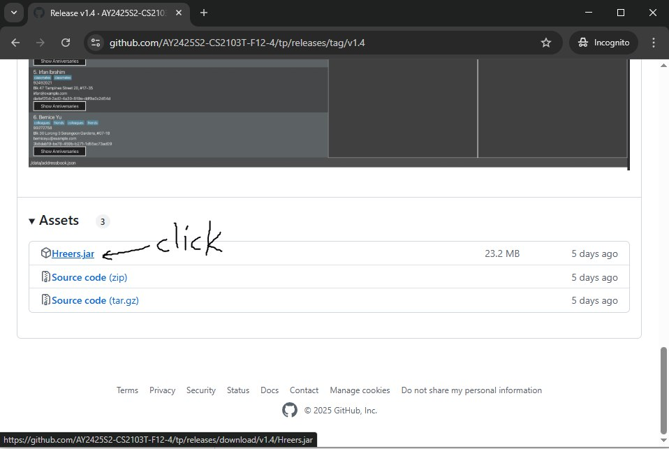
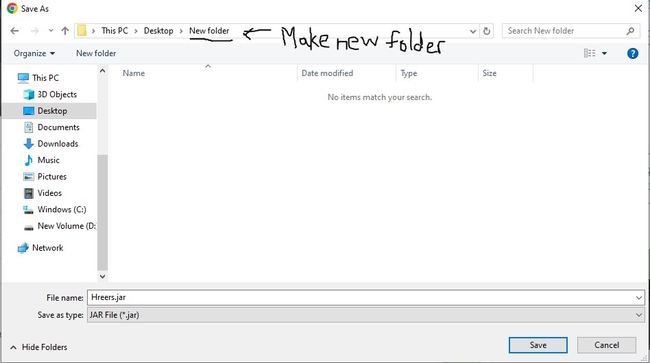
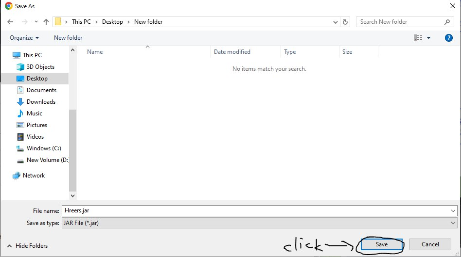
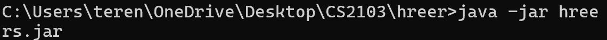
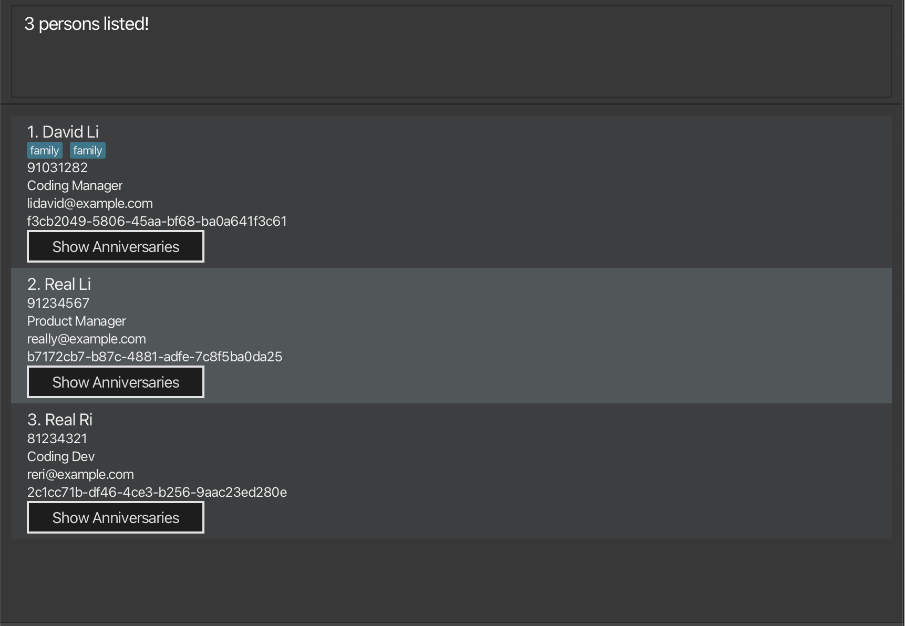
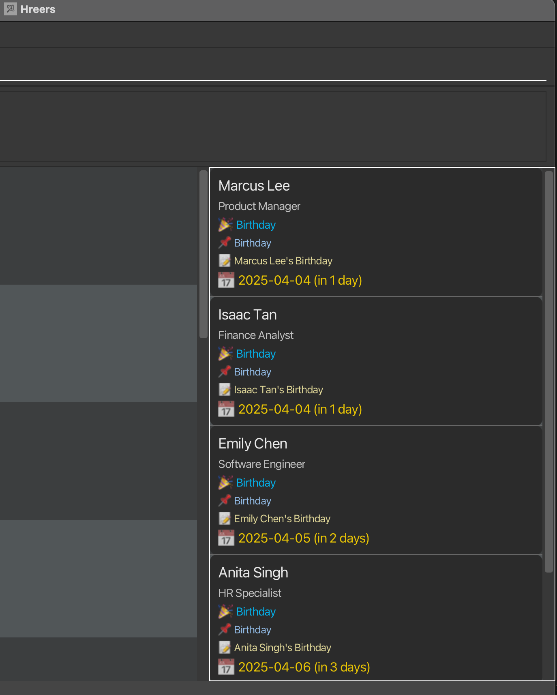

Managing *employee details, birthdays, and work anniversaries* can be time-consuming and prone to error.
For HR professionals, keeping track of all this information manually can become overwhelming, even in small to medium organizations.
**H'Reers** is designed to solve these issues by offering an intuitive desktop application with both a [GUI](#glossary) and [CLI](#glossary) for seamless interaction.

With features like [adding](#adding-an-employee-add), [editing](#editing-an-employee-edit), and [deleting](#deleting-an-employee-delete) employee records and [adding birthdays and anniversaries](#anniversary-commands),
H'Reers helps you to stay organized, accurate, and on top of important milestones.
The [Reminder](#reminder-commands) system provides a focused view of your employees with upcoming events occurring within the next 3 days.
When the [command](#viewing-upcoming-birthdays-reminder-bd) is used, new panels appear beside the main list, displaying the filtered employees.

By centralizing these tasks in one tool, H'Reers makes employee management more efficient and less error-prone, saving you time and improving overall workflow.

Whether you need to track employee milestones, update records, or generate quick reports, H'Reers gives you command-line precision with a simple, friendly interface to back it up.

✅ Designed for fast-paced HR workflows.<br>
🧠 CLI-first so power users get things done quickly.<br>
🎯 Never miss an anniversary, birthday, or detail again.<br>

## 📚 What You’ll Find in This Guide

1. [Quick Start](#quick-start)
2. [Features](#features)
3. [Core Commands](#core-commands)
    - [Viewing help: `help`](#viewing-help-codehelpcode)
    - [Adding an employee: `add`](#adding-an-employee-codeaddcode)
    - [Editing an employee: `edit`](#editing-an-employee-codeeditcode)
    - [Deleting an employee: `delete`](#deleting-an-employee-codedeletecode)
    - [Undoing the last command: `undo`](#undoing-the-last-command-codeundocode)
    - [Listing all employees: `list`](#listing-all-employees-codelistcode)
    - [Locating employees: `find`](#locating-employees-codefindcode)
4. [Anniversary Commands](#anniversary-commands)
    - [Showing anniversaries: `showAnni`](#showing-anniversaries-codeshowannicode)
    - [Adding anniversaries: `addAnni`](#adding-anniversaries-codeaddannicode)
    - [Deleting anniversaries `deleteAnni`](#deleting-anniversaries-codedeleteannicode)
5. [Reminder Commands](#reminder-command)
    - [Viewing upcoming anniversaries `reminder`](#viewing-upcoming-anniversaries-coderemindercode)
6. [Quality of Life Commands](#quality-of-life-features)
    - [Clearing all entries: `clear`](#clearing-all-entries-codeclearcode)
    - [Exiting the program: `exit`](#exiting-the-program-codeexitcode)
7. [Data Management](#data-management)
    - [Saving the data](#saving-the-data)
    - [Editing the data file](#editing-the-data-file)
    - [Importing data: `import`](#importing-data-codeimportcode)
    - [Exporting data: `export`](#exporting-data-codeexportcode)
8. [FAQ & TroubleShooting](#faq)
9. [Known issues](#known-issues)
10. [All Commands at a Glance](#command-summary)
11. [Glossary](#glossary)

--------------------------------------------------------------------------------------------------------------------

## Quick start

1. Make sure Java is installed

   H'Reers runs on Java, a safe and widely-used technology.You need Java version 17.

    * Windows Users: Click [here](https://docs.oracle.com/en/java/javase/17/install/installation-jdk-microsoft-windows-platforms.html#GUID-DAF345BA-B3E7-4CF2-B87A-B6662D691840) for step-by-step instructions.

    *  Mac Users: Follow [this detailed guide](https://se-education.org/guides/tutorials/javaInstallationMac.html) to install the correct version.

    * Not sure if Java is already installed?
      Open your terminal or command prompt and type:
    ```bash
    java -version
    ```
   If the version shows 17, you're good to go

2. Download H'Reers
    1. Go to the official download page [here](https://github.com/AY2425S2-CS2103T-F12-4/tp/releases/tag/v1.4).
    2. Download the latest file ending with .jar.(It may look something like hreers-1.0.jar)
       
    3. Save it in a folder(_home folder_) where you want your H'Reers data to live.
       
       

3. Start the Application
    1. Open your command prompt (on Windows) or terminal (on Mac/Linux).
    2. Navigate to the folder where you saved the .jar file. For example:
        ```bash
         cd /path/to/your/folder
        ```
    3. Run this command:
        ```bash
        java -jar hreers.jar
        ```
   
    4. H'Reers will open in a few seconds with a simple GUI, ready to use!
       

4. Try a Few Commands
   H'reers is shipped with a few sample data for you to try out a few commands to get used to it.
   Here is our recommended list of commands to try - just type them in the command box and press Enter:

    * `list` : Lists all contacts.

    * `add n/John Doe p/98765432 e/johnd@example.com jb/Crypto Minor bd/2000-01-01 wa/2014-12-12` : Adds a contact named `John Doe` to H'Reers.

    * `delete Employee_ID_prefix` : Deletes the specified employee contact. _Note: Employee_ID_prefix has to pinpoint only one Employee for delete to work._

    * `clear` : Deletes all contacts.

    * `exit` : Exits the app.

5. Learn More
- You can explore all available features and commands in the [Features](#features) below.

--------------------------------------------------------------------------------------------------------------------

## Features

This section walks you through the essential commands for managing your employee records — from adding new hires to updating details or removing old entries.

Whether you’re onboarding someone, searching through your team list, or making quick edits, these commands help you get it done fast — all from the command line.

You’ll also find helpful notes below on how to format your commands, including optional fields, parameter order, and best practices.

All commands (eg. `add`, `showAnni`) are **Case sensitive** and must be entered exactly as shown.

---

<div markdown="block" class="alert alert-info">

<br>**:information_source: How to Read the Command Formats**<br>

* Words in `UPPER_CASE` are placeholders — you replace them with actual data.<br>
  e.g. in `add n/NAME`, `NAME` -> `add n/John Doe`.

* Items in square brackets are optional.<br>
  e.g `n/NAME [t/TAG]` can be used as `n/John Doe t/friend` or as `n/John Doe`.

* Items with `…`​ can appear multiple times or not at all.<br>
  e.g. `[t/TAG]…​` can be used as ` ` (i.e. 0 times), `t/friend`, `t/friend t/family` etc.

* Parameter order doesn’t matter.<br>
  e.g. if the command specifies `n/NAME p/PHONE_NUMBER`, `p/PHONE_NUMBER n/NAME` is also acceptable.

* Extraneous parameters for commands that do not take in parameters (such as `help`, `list`, `exit` and `clear`) will be ignored.<br>
  e.g. if the command specifies `help 123`, it will be interpreted as `help`.

* If you are using a PDF version of this document, be careful when copying and pasting commands that span multiple lines as space characters surrounding line-breaks may be omitted when copied over to the application.
</div>

---
## Core Commands

---
### Viewing help: `help`

Shows a message explaining how to access the help page.


Format: `help`

---
### Adding an employee: `add`

You can use this command to add a new employee to H'Reers.

Format: `add n/NAME p/PHONE_NUMBER e/EMAIL jp/JOB [t/TAG]… [bd/DATE] [wa/DATE]​`

Date format: `YYYY-MM-DD`

<div markdown="block" class="alert alert-info">

**:information_source: Notes about the add command:**<br>
* The name only allows letters, numbers, and spaces.
  e.g. `n/John Doe` is valid, but `n/John@Doe` is not.

* You can include as many tags per person as you like — or none at all.

* Use bd/ for the employee’s birthday and wa/ for their work anniversary.
  H'Reers will automatically convert these into standard anniversaries for you.

* If you want to track other types of anniversaries, you can do that later using the [add anniversary command below](#add-anniversaries-codeaddannicode).

* If you repeat a prefix (e.g., `n/Hans n/Jane`), H'Reers will use only the last one (`n/Jane`).
  This applies to all fields — including employee IDs (`eid/abcde eid/bcde` → `eid/bcde` is used).
</div>

Examples:

* `add n/John Doe p/98765432 e/johnd@example.com jp/President bd/2001-01-01 wa/2020-07-08`
    * Adds `John Doe` to H'Reers with birthday and work anniversary tracked.
* `add n/Betsy Crowe t/Part Time Worker e/betsycrowe@example.com jp/Cleaner p/1234567 t/Personal Trainer bd/2005-12-01 wa/2025-05-21`
    * Adds `Betsy Crowe` with two tags (`Part Time Worker` and `Personal Trainer`) and both standard anniversaries.

---

### Editing an employee: `edit`

Edits an existing employee in H'Reers.

Format: `edit Employee_ID_prefix [n/NAME] [eid/EMPLOYEE_ID] [p/PHONE] [e/EMAIL] [jp/JOB] [t/TAG]…​`

* Edits the specified employee. The Employee ID can be shortened down and not necessarily needed to type in the full ID. The Employee ID prefix **must be Unique.**
* At least one of the optional fields must be provided.
* Existing values will be updated to the input values.
* When editing tags, the existing tags of the employee will be removed i.e adding of tags is not cumulative.
* You can remove all the employee’s tags by typing `t/` without
  specifying any tags after it.
* You can change the employee id by typing `edit Employee_ID_prefix eid/Employee_ID` where Employee_ID is the new full string of a valid eid.

Examples:
*  `edit 1re p/91234567 e/johndoe@example.com` Edits the phone number and email address of the specified employee to be `91234567` and `johndoe@example.com` respectively.
*  `edit 2dsf n/Betsy Crower t/` Edits the name of the specified employee to be `Betsy Crower` and clears all existing tags.
*  `edit 1sdg21 eid/3b9417cc-cf4e-4231-bc4d-4fd167c2abc6` Edits the employee id to be now `3b9417cc-cf4e-4231-bc4d-4fd167c2abc6` so long as no such employee id already exists.

---
### Deleting an employee: `delete`

Deletes the specified employee from H'Reers.

Format: `delete Employee_ID_prefix`

* Deletes the employee of the specified Employee ID.
* The Employee ID **must be valid and unique**

Examples:
* `list` followed by `delete Employee_ID_prefix` deletes the specified employee.

---

### Undoing the last command: `undo`

Will undo to before the data is changed.

Format: `undo`

* Only works if any data in H'Reers has been changed.

#### Output:
* If data has been changed: `Undo successful!`
* No data changed: `No undo available!`

Examples:
* `undo` Will return the previous changed saved data.
* `undo 2` Will still return to the previous changed saved data as `undo` ignores all parameters after it.

---
### Listing all employees: `list`

You can use this command when you want to view all employees currently stored in H'Reers.

Format: `list`

* This shows every employee in the system — regardless of filters you may have used previously.
* If you've just used the `find` command and want to see the full list again, simply type `list`.

---
### Locating employees: `find`

You can use this command to search for employees whose name or/and job position contains specific keywords.

<div markdown="span" class="alert alert-primary">:bulb: Tip:
You can use this format in 3 ways!
</div>

Format 1 (Searching for name): `find n/KEYWORD [MORE_KEYWORDS]`

Format 2 (Searching for job positions): `find jp/KEYWORD [MORE_KEYWORDS]`

Format 3 (Searching for both name and job positions): `find n/KEYWORD [MORE_KEYWORDS] jp/KEYWORD [MORE_KEYWORDS]`

* The search is case-insensitive. e.g `hans` will match `Hans`
* The order of the keywords does not matter. e.g. `Hans Bo` will match `Bo Hans`
* [For **Job Positions**] Only full words will be matched e.g. `Mana` will not match `Manager`
* [For **Name**] Partial words can be matched e.g. `Han` will match `Hans`

<div markdown="block" class="alert alert-info">

**:information_source: Notes about the find command:**<br>

* When you search within a single field (like n/ for name or jp/ for job position), you only need one of the keywords to match.

    * For example: find `n/Hans Bo` will find anyone with "Hans" or "Bo" in their name, like `Hans Gruber` **or** `Bo Yang`.

* When you use both fields together, the command finds people who match all of them.

    * For example: `find n/Hans jp/engineer` finds people whose name includes "Hans" **and** whose job position includes "engineer".

* In the case of multiple fields and keywords, you will only see a employee on the list if they match at least one keyword from each field.

    * So `find n/Hans Bo jp/dev manager` finds people whose name contains "Hans" **or** "Bo", **and** whose job position has the word "dev" **or** "manager".
</div>

Examples:
* `find n/li` returns `David Li` and `Real Li`
* `find n/david Li` returns `David Li` and `Real Li`
* `find n/li ri jp/ dev manager` returns `David Li`, `Real Ri` and `Real Li`<br>

The screenshot below shows the result of the command `find n/li ri jp/ dev manager` with all 3 employees existing in the system:


---

## Anniversary Commands
Great HR isn’t just about managing people — it’s about remembering what matters.

Anniversaries in Hreers aren’t stored as biographical data.  
They’re designed to **remind you when a meaningful date is coming up — not to log when it originally occurred**.

For example, even if someone was born on `2002-08-12`, you can (and should) enter it as `2025-08-12` — because the system is there to help you **celebrate the next time that date arrives**.

You can still set past dates for flexibility, but Hreers is fundamentally forward-looking: it’s about what’s next, not what’s already happened.

This section helps you keep track of key employee milestones like work anniversaries, promotions, or other custom events. Celebrate achievements, strengthen morale, and never let an important date slip by.
With just a few commands, you can:

- Add meaningful events tied to specific employees
- View Anniversaries related to a specific employee
- View all upcoming anniversaries (Minseok go add this)
- Remove outdated or incorrect entries

---

### Showing anniversaries: `showAnni`

You can use this command to view all anniversaries linked to a specific employee, based on their Employee ID.

Format: `showAnni eid/Employee_ID`

What will you see:

* A new window will open showing the employee’s anniversaries.
* You’ll see details like the date, name, and description of each anniversary.
* If you’re new to the app, you can also use the “Show Anniversaries” button in the GUI instead of typing the command.

<div markdown="block" class="alert alert-info">

**:information_source: Notes about the showAnni command:**<br>
* The Employee ID is a unique identifier assigned to each employee in H'Reers — either entered by you during creation, or auto-generated if left blank.

* If you provide multiple eid/ values, H'Reers will use the last one on the right.
    * For example : `showAnni eid/abcde eid/bcde` will use `eid/bcde`.
</div>

Example:
* `showAnni eid/e22e5292-0353-49a9-9281-5a76e53bc94f`
    * Opens a window showing anniversaries for the employee with the specified ID.

---

### Adding Anniversaries: `addAnni`
Adds an anniversary to an employee's record in the Hreers application.
This command can create custom Anniversaries that were otherwise not supported within the `add` Command.

> As the application's purpose is to keep track of **upcoming** anniversaries, it is allows the addition of anniversaries that are in the future.
Anniversaries are reminders — not historical facts.

You don’t have to (and usually shouldn’t) go back to the original date something happened — you’re telling Hreers **when to start tracking it from**, so you’ll be reminded when it comes next.
As a precautionary measure against deliberate attacks to the system, certain words, such as `drop` or other backspace characters are disallowed for anniversary names or types.

<div markdown="span" class="alert alert-primary">:bulb: **Tip:**
You can use this format in 3 ways!
</div>

Format 1 : default format for **custom** anniversaries
``` plaintext
addAnni eid/EMPLOYEE_ID_PREFIX d/DATE an/ANNIVERSARY_NAME at/ANNIVERSARY_TYPE [ad/DESCRIPTION] [atdesc/TYPE_DESCRIPTION]
```
Format 2 : short form support for Birthday Anniversaries (not Date of Birth)
> **Note:** The `bd/` field represents a **birthday anniversary** — a recurring date used for tracking and reminders — not the employee's immutable date of birth.  
> It is valid and expected to input **future dates**, such as birthdays of upcoming employees, new hires, or family members associated with the employee.  
> This aligns with the application's core purpose: **tracking upcoming anniversaries**.
``` plaintext
addAnni eid/EMPLOYEE_ID_PREFIX n/name bd/DATE
```
Format 3 : short form support for Work Anniversaries
``` plaintext
addAnni eid/EMPLOYEE_ID_PREFIX n/name wa/DATE
```
<div markdown="block" class="alert alert-info">

**:information_source: Notes about the addAnni command:**<br>

* When you put duplicated options , such as `eid\abcde eid\bcde`, the prefix value that occurs last (right) `eid\bcde` is used.

    * For example : `addAnni eid/SOME_EID an/Hans' Wedding an/Hans' birthday` will use `Hans' birthday`.

* When you try to mix the different formats together, they will fail.

    * For example: `addAnni eid/SOME_EID an/Hans' Birthday at/Birthday bd/2025-04-25`, this will fail.

* Unlike `add` which allows the attachment of work anniversaries and birthday together, addAnni does **not** support this feature.
* For dates, only the following format `YYYY-MM-DD` is supported as input. other date formats will fail
* Inputs such as `an/      at/      atdesc/...` will fail.
* In exceptional cases, as a mitigation for corrupted files, there may be a case where name can be filled via the anniversary type. However, this is only present as a fallback for internal features.
* **Duplicate** anniversaries are not possible. If there exist an identical entry (case-sensitive), an error will show.
* there can be multiple birthdays and work anniversaries added. this is a valid design choice, used to accomodate for next-of-kin's birthday. There is no limit to how many, but do use sparingly
* There is a hard limit of 1000 characters in the name and type field. This is to prevent UI abuse
</div>

Examples :
```plaintext
addAnni eid/0c2414da d/2025-03-13 an/Silver Wedding at/Wedding ad/Celebrating 25 years atdesc/Personal
```
- `addAnni` - the addAnniversary command you are running
- `eid/0c2414da`: the Employee Id prefix of the employee you are trying to attach the anniversary to
- `d/2025-03-13`: the date of the anniversary on `2025-03-13`
- `an/Silver Wedding`: the name of the anniversary `Silver Wedding`
- `at/Wedding`: The name of the anniversary type - `Wedding`
- `ad/Celebrating 25 years` :  The description of the anniversary - `Celebrating 25 years` (optional)
- `atdesc/Personal`: The description of the anniversary type -`Personal` (optional)

If exactly one employee’s ID starts with `0c2414da`, this will create a `Silver Wedding` anniversary of the type `Wedding` for that employee, with an optional description and additional type descriptors.

```plaintext
addAnni eid/0c2414da n/Alex shenanigans bd/2025-03-13
```
- `addAnni` - the addAnniversary command declaration
- `eid/0c2414da`: the Employee Id prefix of the employee you are trying to attach the anniversary to
- `n/Alex shenanigans`: the name of the person you are attaching the birthday to (note that it is **strongly** recommended to use the name of the person the employee id belongs, unless otherwise needed)
- `bd/2025-03-13`: the date of the anniversary on `2025-03-13`
  If exactly one employee’s ID starts with `0c2414da`, this will create a `birthday` (anniversary) with the Persons' `name` specified in the command.

```plaintext
addAnni eid/0c2414da n/Alex shenanigans wa/2025-03-13
```
- `addAnni` - the addAnniversary command declaration
- `eid/0c2414da`: the Employee Id prefix of the employee you are trying to attach the anniversary to
- `n/Alex shenanigans`: the name of the person you are attaching the birthday to (note that it is **strongly** recommended to use the name of the person the employee id belongs, unless otherwise needed)
- `wa/2025-03-13`: the date of the anniversary on `2025-03-13`
  If exactly one employee’s ID starts with `0c2414da`, this will create a `work anniversary` with the Persons' `name` specified in the command.

#### Options summary

| **Prefix** | **Meaning**                                               | **Required?**                     | **Example Value**      |
|------------|-----------------------------------------------------------|-----------------------------------|------------------------|
| `eid/`      | A partial prefix of the Employee ID                       | Required                          | `0c2414da`             |
| `d/`       | The date of the anniversary                               | Required                          | `2025-03-13`           |
| `an/`      | A short name for the anniversary                          | Required                          | `Silver Wedding`       |
| `at/`      | The main category/type of the event                       | Required                          | `Wedding`              |
| `desc/`    | A text description of the anniversary                     | Optional                          | `Celebrating 25 years` |
| `atdesc/`  | A description of the type                                 | Optional                          | `Personal`, `Work`     |
| `bd/`      | A short name for the birthday                             | Optional                          | `Birthday`             |
| `wa/`      | A short name for the work anniversary                     | Optional                          | `Work Anniversary`     |
| `n/`       | Name of the person required for birthday/work anniversary | Optional(required for bd/wa only) | `Alex shenanigans`     |

---

### Deleting Anniversaries: `deleteAnni`
Removes a specific anniversary from an existing employee’s record, based on the anniversary's
order within the Employee's list of anniversaries.
If successful, the chosen anniversary will no longer appear in that employee’s list of anniversaries.

<div markdown="block" class="alert alert-info">

**:information_source: Notes about the deleteAnni command:**<br>
* deleteAnni **cannot** be undone via `undo`. so be very very careful
* When you put duplicated options , such as `eid\abcde eid\bcde`, the prefix value that occurs last (right) `eid\bcde` is used.

    * For example : `addAnni eid/... ai/1' ai/2` will use `2` as the index parameter.

* When the `eid/...` is not specific enough and there exists multiple people, the command will fail. Should this case occur, type a few more letters matching the EmployeeID in.

* When there are **NO** matching employees, this will throw an error.
* When the index specified is **out of bounds** of the anniversary list attached to the employee, the command will fail
* The index of the anniversary is where the anniversary is located when seen via the `showAnni`.
</div>

Format:
```plaintext
deleteAnniversary eid/EMPLOYEE_ID ai/INDEX
```

Examples:
```plaintext
deleteAnniversary eid/0c2414da ai/1
```
- `deleteAnniversary` - the command you are running
- `eid/0c2414da`: the Employee Id prefix you are attaching the anniversary to
- `ai/1`: the index of the anniversary you want to delete
  this will delete the anniversary at index 1 of the employee with the Employee ID prefix `0c2414da`.

#### Options Summary

| **Prefix** | **Meaning**                                                   | **Required?** | **Example**  |
|------------|---------------------------------------------------------------|---------------|-------------|
| `eid/`     | A partial (or full) prefix of the Employee ID                | Required      | `0c2414da`  |
| `ai/`      | The 1-based index of the anniversary you wish to remove      | Required      | `1`         |


---
## Reminder Command

---
### Viewing upcoming anniversaries: `reminder`

You can use this command to view all employee anniversaries (birthdays, work anniversaries, and custom anniversaries) that are occurring within the next 3 days.

Format: `reminder`

What will you see:

* A reminder panel appears on the right side of the UI.
* All upcoming anniversaries (within 3 days) will be displayed in one combined list.
* Each reminder card shows:
    * The employee’s **name**
    * Their **job position**
    * The **type** and **name** of the anniversary (e.g., 🎂 Birthday, 🎉 Work Anniversary, 🥂 Custom)
    * The **anniversary date**
    * How many days remain (e.g., “in 2 days”)

<div markdown="block" class="alert alert-info">

**information_source: Notes about the `reminder` command:**<br>
* This command only affects the display — it does **not** modify any data.
* All anniversaries shown are automatically sorted by how soon they are occurring.
* If an employee has more than one upcoming anniversary, they will appear **multiple times** in the list.
</div>

Example:
* `reminder`
    * Displays a unified list of upcoming birthdays, work anniversaries, and custom anniversaries.

Example UI:



Each card in the reminder panel corresponds to one upcoming anniversary for an employee.

---
## Quality of Life Features

---
### Clearing all entries: `clear`

Clears all entries from H'Reers.

Format: `clear`

---
### Exiting the program: `exit`

Exits the program.

Format: `exit`

---
## Data Management

---
### Saving the data

H'Reers data are saved in the hard disk automatically after any command that changes the data. There is no need to save manually.

---
### Editing the data file

H'Reers data are saved automatically as a JSON file `[JAR file location]/data/H'Reers.json`. Advanced users are welcome to update data directly by editing that data file.

<div markdown="span" class="alert alert-warning">:exclamation: **Caution:**
If your changes to the data file makes its format invalid, H'Reers will discard all data and start with an empty data file at the next run. Hence, it is recommended to take a backup of the file before editing it.<br>
Furthermore, certain edits can cause the H'Reers to behave in unexpected ways (e.g., if a value entered is outside of the acceptable range). Therefore, edit the data file only if you are confident that you can update it correctly.
</div>

---
### Importing data: `import`

> **Warning: This feature is sensitive. Use it with care.**
> - The system has been tested, but **cannot guarantee** perfect results in all situations.
> - The system **expects** the format in export to be strictly followed.
> - certain locales or language settings may cause issues with the import.
> - If the file format or content is incorrect, the results may be unpredictable.
> - If the file is formatted improperly, the data may be lost or corrupted without any warning.

The `import` command lets you **bring employee data** into Hreers from an external file (like one you export from Excel).

This is useful when you want to:
- Add a group of employees to Hreers
- Merge data about employee anniversaries
- Bulk load data from a file to Hreers

<div markdown="block" class="alert alert-info">
**:information_source: Notes about the export command:**<br>
#### What kind of files can I use?

- Only **CSV (.csv)** or **JSON (.json)** files are accepted.
- If you're working in Excel, **you must save your file as `.csv` format**, particularly [CSV UTF-8 (Comma delimited)](https://www.ablebits.com/office-addins-blog/convert-excel-csv/#:~:text=Export%20to%20CSV%20UTF%2D8,Done!)
- Excel may change the **date format** or cause issues with certain fonts or languages. This can break the import. To fix this:
    - Save your file using **UTF-8 encoding**. Follow the steps at saving your excel files as a [CSV UTF-8 (Comma delimited)](https://www.ablebits.com/office-addins-blog/convert-excel-csv/#:~:text=Export%20to%20CSV%20UTF%2D8,Done!).
    - Make sure dates follow this format: `dd-MM-YYYY` (e.g., 23-04-2022).

#### Important Rules

1. **The column headers (top row) must exactly match** the format from Hreers' exported files. Don't change them.
2. **Don't duplicate csv headers or json fields.**
3. **Each employee must have a valid ID (called `employeeId`)** in Universally Unique Identifier (UUID) format. You can generate one online [here](https://www.uuidgenerator.net/).
4. If your file has issues (wrong format, corrupted, etc.), the system may fail silently—**you won't always see an error message**.

#### Write Modes: What Happens During Import

There are **two modes** for importing data. You must choose one:

**1. Append Mode (merging into existing records)**
- If an employee with the **same ID and same details** already exists, we will **merge their anniversary fields (to track) **.
- If the employee does not exist, we will **add them as new**.
- If an employee with the **same ID but different details** is found, we **will not add them** — they will appear in a list of skipped entries.
- If two employee IDs share the same **prefix** (first few characters), those will also be skipped.
- Formatting mistakes may cause the import to fail, at times, without notice.

### 2. Overwrite Mode (replacing current records)
- This mode **replaces your entire database with the new file**.
- If there is **any error**, **nothing** will be imported. This is to protect your existing data.

#### File Path & Filename Usage
- You can provide a complete file path with extension via `fp/`.
- If you also supply `fn/`, ensure `fp/` is just a directory (or the import will fail).

#### Extension Enforcement

- If you use `fn/` without an extension, the system may automatically append `.json` or `.csv` based on `ft/`.
- Mismatched extensions will raise an error.

#### Common Errors & Messages
- **Invalid file type**: Provide either `json` or `csv` in `ft/`.
- **Write mode must be specified as either 'append' or 'overwrite'**: Ensure `wm/` is one of the two valid modes.
- **Provide either a full file path or a filename, not both**: This occurs if you pass `fp/` that includes a filename and also use `fn/`.
- **Filename must be provided if path is just a directory**: If `fp/` is a directory, you must specify a filename (`fn/`).

#### Tips
- **Check Extension Conflicts**: If your file says `.json` but you specify `ft/csv`, it will fail.
- **Ensure Proper Permissions**: The path must be writable or readable for the import to succeed.
- **Use Overwrite Cautiously**: This mode replaces all current data, so confirm backups if needed.

</div>

#### Command Format
```plaintext
import ft/FILE_TYPE fp/FILE_PATH fn/FILE_NAME wm/WRITE_MODE
```

### **Example Usage**
```plaintext
import ft/json fp/data/ fn/contacts wm/append
```
Explanation:
`import` — the command you're running
`ft/json` — file type is JSON
`fp/data/` — file path is the data/ directory
`fn/contacts` — file name is contacts (without extension)
this will import the file `contacts.json` from `/data` directory and append the data to the current Hreers application.

```plaintext
import ft/json fp/data/ fn/contacts wm/overwrite
```
Explanation:
`import` — the command you're running
`ft/json` — file type is JSON
`fp/data/` — file path is the data/ directory
`fn/contacts` — file name is contacts (without extension)
this will import the file `contacts.json` from `/data` directory and **overwrite** the data to the current Hreers application.

```plaintext
import ft/csv fp/data/contacts.csv wm/append
```
Explanation:
`import` — the command you're running
`ft/csv` — file type is CSV
`fp/data/contacts.csv` — file path is the data/ directory
this will import the file `contacts.csv` from `/data` directory and append the data to the current Hreers application.

#### ptions Summary

| **Prefix** | **Meaning**                                       | **Required?**                          | **Example Value**           |
|------------|---------------------------------------------------|----------------------------------------|-----------------------------|
| `ft/`      | File type to import (`json` or `csv`)             | **Required**                           | `json` / `csv`             |
| `fp/`      | Optional base directory or file path              | At least one of `fp/` or `fn/` required| `./data` / `C:\Users\John\`|
| `fn/`      | Optional filename (extension can be auto-added)   | At least one of `fp/` or `fn/` required| `myData.json`               |
| `wm/`      | Write mode (`append` or `overwrite`)              | **Required**                           | `append` / `overwrite`      |


---
### Exporting data: `export`
saves the currently visible list of people in the Hreers application to a file (JSON or CSV).


<div markdown="block" class="alert alert-info">

**:information_source: Notes about the export command:**<br>
* If you provide a specific directory path (`fp/`), the system will export the file there.
* You must specify either `json` or `csv` using `ft/`
* If you also include a file name (`fn/`), any missing extension is automatically appended based on the file type (`ft/`) chosen
    * For example, If you use `fn/contacts` but `ft/json`, the resulting file is `contacts.json`.
* This means that you do **not** need to include the extension behind the file name.
* If you do not provide (`fp/`), the default export location will be where the `jar` file is located.
* If you specify a full file path including file name at `fp`, do not use `fn/` together.
    * For example, do not do `fp/data/output.json fn/output`
* For CSV based inputs, an employee entry with multiple Anniversaries will be duplicated to multiple rows with same employeeId and same details(name, job position, phone number, email), but each row having different anniversaries
* If the current list of displayed people is empty, export fails with an error.
* Mismatched file types or inaccessible folders will cause an error.

</div>

Format
```plaintext
export ft/FILE_TYPE [fp/FILE_PATH] [fn/FILE_NAME]
```

### **Example Usage**
```plaintext
export ft/json fp/data/ fn/contacts
```
Explanation:
`export` — the command you're running
`ft/json` — file type is JSON
`fp/data/` — file path is the data/ directory
`fn/contacts` — file name is contacts (without extension)

This will save your current contact list as a file named contacts.json in the data/ folder.

```plaintext
export ft/csv fp/data/contacts.csv
```
Explanation:
`export` — the command you're running
`ft/csv` — file type is CSV
`fp/data/contacts.csv` — file path is the data/ directory and the file name is contacts.csv - note that if you want to define the file within the file path, you have to ensure that the file type matches the extension of your file. so `contaacts.json` when set to csv will give you an error

This will save your current contact list as a file named contacts.csv in the data/ folder.

```plaintext
export ft/json fp/data/ fn/contacts
```
Explanation:
`export` — the command you're running
`ft/json` — file type is JSON
`fp/data/` — file path is the data/ directory
`fn/contacts` — file name is contacts (without extension)

This will save your current contact list as a file named contacts.json in the data/ folder.

```plaintext
export ft/json
```
Explanation:
`export` — the command you're running
`ft/json` — file type is JSON

This will save your current contact list as a file named `output.json` in the folder where the jar is stored.
As a convenience, on the in-app output, it will show how many employees have been saved.


#### Options Summary

| **Prefix** | **Meaning**                                     | **Required?**              | **Example Value**     |
|------------|-------------------------------------------------|----------------------------|------------------------|
| `ft/`      | The file type to export (`json` or `csv`)       | **Required**               | `json` or `csv`       |
| `fp/`      | The optional file path (directory or full path) | Optional if `fn/` is used | `./output/`           |
| `fn/`      | The optional filename (extension auto-added)    | Optional if `fp/` is used | `contacts`, `data.csv`|

--------------------------------------------------------------------------------------------------------------------
## Frequently asked questions and Troubleshooting
We know that even the smoothest apps can have a few bumps along the way. This section is here to help you solve common problems and answer questions that come up often — no tech expertise required.

Whether you're setting up H'Reers on a new machine or wondering why the help window isn't showing up, we’ve got you covered.

---
### FAQ

**Q**: How do I transfer my data to another Computer?<br>
**A**: Install the app in the other computer and overwrite the empty data file it creates with the file that contains the data of your previous H'Reers home folder.<br>

--------------------------------------------------------------------------------------------------------------------

## Known issues

1. **Multiple Monitor Setup**: When using multiple screens, if you move the application to a secondary screen, and later switch to using only the primary screen, the GUI will open off-screen.
    * **Solution**: Delete the `preferences.json` file created by the application before running the application again.
2. **Help Window**: If you minimize the Help Window and then run the `help` command (or use the `Help` menu, or the keyboard shortcut `F1`) again, the original Help Window will remain minimized, and no new Help Window will appear.
    * **Solution**: Manually restore the minimized Help Window.
3. **Full-Screen Help Window**: When the app is in full-screen mode, clicking the help button opens the Help Window in a new full-screen view rather than as a pop-up overlay.
    * **Solution**: Exit full-screen mode before opening the Help Window to have it display as a pop-up.

--------------------------------------------------------------------------------------------------------------------

## Command summary

Action | Format, Examples
--------|------------------
**Help** | `help`
**Add** | `add n/NAME p/PHONE_NUMBER e/EMAIL jp/JOB [t/TAG]…​` <br> e.g., `add n/James Ho p/22224444 e/jamesho@example.com jb/Crypto Farmer t/friend t/colleague bd/2001-07-08 wa/2025-08-15`
**List** | `list`
**Edit** | `edit Employee_ID_Prefix [n/NAME] [p/PHONE_NUMBER] [e/EMAIL] [jb/JOB] [t/TAG]…​`<br> e.g.,`edit 12sde n/James Lee e/jameslee@example.com`
**Undo**| `undo`
**Find** | `find KEYWORD [MORE_KEYWORDS]`<br> e.g., `find James Jake`
**Delete** | `delete Employee_ID_Prefix`
**Clear** | `clear`
**addAnni** | `addAnni eid/EMPLOYEE_ID_PREFIX d/DATE an/ANNIVERSARY_NAME at/ANNIVERSARY_TYPE [ad/DESCRIPTION] [atdesc/TYPE_DESCRIPTION]`<br> e.g., `addAnni eid/0c2414da d/2025-03-13 an/Silver Wedding at/Wedding ad/Celebrating 25 years atdesc/Personal`
**showAnni** | `showAnni eid/Empoyee_ID`<br> e.g., `showAnni eid/e22e5292-0353-49a9-9281-5a76e53bc94f`
**deleteAnni** | `deleteAnniversary eid/EMPLOYEE_ID ai/INDEX`<br> e.g., `deleteAnniversary eid/0c2414da ai/1`
**import** | `import ft/FILE_TYPE fp/FILE_PATH fn/FILE_NAME wm/WRITE_MODE`<br> e.g., `import ft/json fp/data/ fn/contacts wm/append`
**export** | `export ft/json fp/data/ fn/contacts`<br> e.g., `export ft/json fp/data/ fn/contacts`

---
## Glossary
* CLI (Command Line Interface): A text-based interface used to type commands
* GUI (Graphical User Interface): A user interface that allows interaction with the software through visual elements like buttons and icons.
